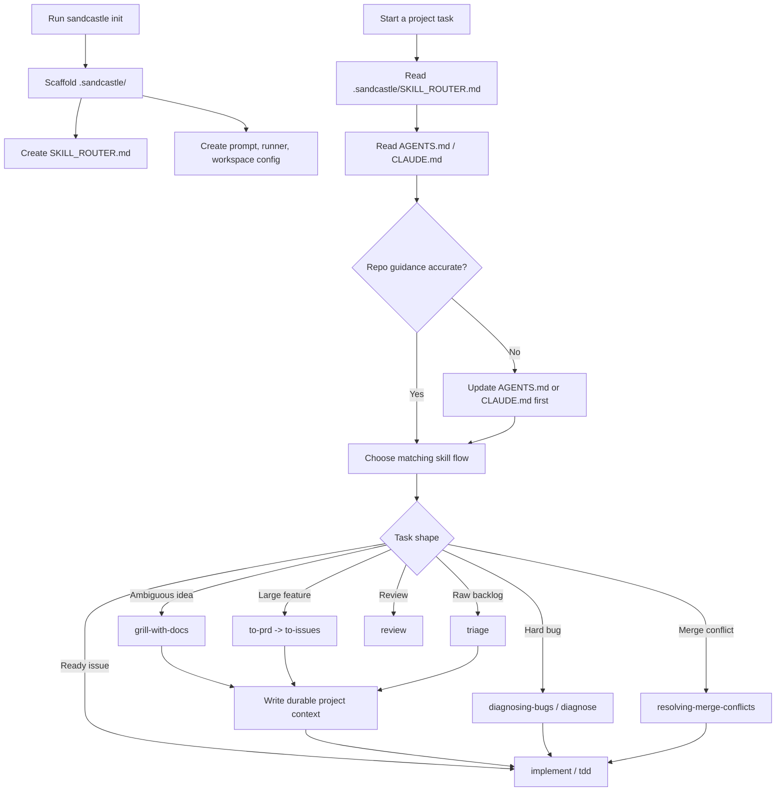

<div align="center">
  <picture>
    <source media="(prefers-color-scheme: dark)" srcset="https://res.cloudinary.com/total-typescript/image/upload/v1775033787/readme-sandcastle-ondark_2x.png">
    <source media="(prefers-color-scheme: light)" srcset="https://res.cloudinary.com/total-typescript/image/upload/v1775033787/readme-sandcastle-onlight_2x.png">
    
  </picture>
</div>

## What Is Sandcastle?

A local workflow board for planning, approving, running, and verifying AI coding agent work in isolated sandboxes:

1. You start with a task or PRD in `sandcastle board`.
2. Sandcastle turns it into alignment notes, a technical plan, and repository issues for review.
3. After approval, Sandcastle runs sandboxed agents, tracks their progress, records artifacts, and verifies the delivery.

Sandcastle is also a TypeScript orchestration library for custom automation. It is provider-agnostic — it ships with built-in providers for Docker, Podman, and Vercel, and you can create your own. Use the Board for the default human-in-the-loop workflow, and drop to `run()`, `runWorkspaceTask()`, or `runWorkspace()` when you need a custom script or integration.

## Prerequisites

- [Git](https://git-scm.com/)
- A sandbox provider — Sandcastle needs an isolated environment to run agents in. Built-in options:
  - [Docker Desktop](https://www.docker.com/) — most common for local development
  - [Podman](https://podman.io/) — rootless alternative to Docker
  - [Vercel](https://vercel.com/) — cloud-based Firecracker microVMs via `@vercel/sandbox`
  - Or [create your own](#custom-sandbox-providers) using `createBindMountSandboxProvider` or `createIsolatedSandboxProvider`

## Quick start

By the end of this path, you should know three things:

- how to scaffold Sandcastle config for a repository
- how to start a Board task from a PRD or from the browser
- when to stay in `sandcastle board` and when to use lower-level programmatic APIs

1. Install the package:

```bash
npm install --save-dev @chenshaohui6988/sandcastle
```

2. Run `npx @chenshaohui6988/sandcastle init`. This scaffolds a `.sandcastle` directory with all the files needed.

```bash
npx @chenshaohui6988/sandcastle init
```

3. Edit `.sandcastle/.env` and fill in your default values for `CLAUDE_CODE_OAUTH_TOKEN` (run `claude setup-token` on your host to get one). To use an Anthropic API key instead, uncomment and fill in `ANTHROPIC_API_KEY`.

```bash
cp .sandcastle/.env.example .sandcastle/.env
```

4. Start the workflow board:

```bash
npx @chenshaohui6988/sandcastle board
```

Open `http://127.0.0.1:4318`, create a task, review the generated plan, then approve execution when the repository issues look right. To start directly from a PRD file, run:

```bash
npx @chenshaohui6988/sandcastle board --prd-file ./prd.md
```

Use `--planning-only` when you want the Board to produce `workspace-plan.json`, `alignment.md`, `technical-plan.md`, and `issues/*.md` without starting AFK execution after approval.

## Quick Smoke Test

Before you hand Sandcastle a real task, start the Board and run a planning-only task. This confirms the server starts, the agent authenticates, the planner can produce a workspace plan, and approval exports artifacts without touching code.

Put this tiny PRD in `./smoke-prd.md`:

```markdown
# Smoke Test

Read this repository's AGENTS.md, CLAUDE.md if present, and .sandcastle/SKILL_ROUTER.md.
Create a plan for explaining which workflow should be used for a small bug fix.
Do not ask for code changes.
```

Then launch the Board in planning-only mode:

```bash
npx @chenshaohui6988/sandcastle board --prd-file ./smoke-prd.md --planning-only
```

Open `http://127.0.0.1:4318`, let the interactive planning phases finish, review the generated plan, then click **Export artifacts**. A healthy smoke test writes planning artifacts under `.scratch/smoke-prd/` and does not start repository execution.

If it hangs or throws instead, you have isolated the failure to setup rather than your task. Common causes:

- **Auth** — `CLAUDE_CODE_OAUTH_TOKEN` (or `ANTHROPIC_API_KEY`) missing or invalid in `.sandcastle/.env`
- **Sandbox** — Docker/Podman is not running, or the image is not built yet (`sandcastle docker build-image`)
- **Network** — the agent CLI cannot reach its model provider from inside the sandbox

Best practice: re-run this check after editing your Dockerfile, rotating tokens, or upgrading Sandcastle. A green Board smoke test confirms the planning and approval path before you debug a real run.

## Agent Skill Routing

Sandcastle scaffolds `.sandcastle/SKILL_ROUTER.md` as a companion workflow guide. Before an agent starts project work, it should read the router, choose the matching skill flow, and make sure the target repository's `AGENTS.md` or `CLAUDE.md` accurately describes the project-specific rules.

Think of the router as a table of contents for agent work. It does not install every skill, and it does not replace project guidance. It helps the agent answer one question first: "What kind of work is this?"

Codex and Claude Code can load skills differently, but the Sandcastle habit is the same: choose first, load second. Codex should keep the selected skills active in its skill profile. Claude Code should have the matching `SKILL.md` directories available under `.claude/skills/` so its native skill discovery can read only the skills needed for the task.

This is the recommended entry sequence:

1. Run `sandcastle init`.
2. Review `.sandcastle/SKILL_ROUTER.md`.
3. Sync the selected skills into the active agent setup.
4. Update `AGENTS.md` or `CLAUDE.md` when project guidance is missing or stale.
5. Start implementation only after the workflow is selected.

See [`sandcastle init`](#sandcastle-init) for the full business flow diagram and best practices.

## Learn The Workflow

Sandcastle is easiest to learn as a sequence, not as an API catalog.

### 1. Start With The Workflow Board

Use `sandcastle init` first, then start `sandcastle board`. Init creates the local config under `.sandcastle/`; the Board gives you the default human-in-the-loop path for planning, approval, execution, artifact review, and verification. Do not start by writing a custom orchestration script unless you already know which lifecycle you need.

After init, inspect these files:

| File                          | What to learn from it                                                 |
| ----------------------------- | --------------------------------------------------------------------- |
| `.sandcastle/main.ts`         | A lower-level runner example for custom programmatic workflows        |
| `.sandcastle/prompt.md`       | What the agent is asked to do each iteration                          |
| `.sandcastle/SKILL_ROUTER.md` | Which skill flow should be selected before project work starts        |
| `.sandcastle/workspace.json`  | Which repositories the Board can plan and execute against             |
| `.sandcastle/.env.example`    | Which host-side credentials the selected agent and issue tracker need |

### 2. Pick The Right Execution Shape

Choose the smallest API that matches the work:

| Situation                                                      | Use this                                               | Why                                                            |
| -------------------------------------------------------------- | ------------------------------------------------------ | -------------------------------------------------------------- |
| You have a PRD or product request and want approval gates      | `sandcastle board --prd-file ./prd.md`                 | Plans, lets you review, executes after approval, then verifies |
| You already reviewed a generated `workspace-plan.json`         | `sandcastle board --plan-file <path>`                  | Imports the plan into Board approval and verification          |
| You want planning artifacts but not AFK execution              | `sandcastle board --prd-file ./prd.md --planning-only` | Uses the Board planning flow and stops after export            |
| You need a non-Board planning artifact pipeline                | `sandcastle workspace plan` / `execute`                | Runs the same plan/execute flow from the CLI                   |
| One prompt, one repository inside a custom script              | `run()`                                                | Starts an agent once or for a bounded number of iterations     |
| Several agent passes on the same branch inside a custom script | `createSandbox()`                                      | Reuses one sandbox for implement-then-review or repair loops   |
| You need a managed branch before running agent                 | `createWorktree()`                                     | Gives you direct control over worktree lifecycle               |
| One agent must see several repos at once                       | `runWorkspace()`                                       | Lower-level multi-repo sandbox primitive                       |

### 3. Do A First Practice Run

For a safe first pass, put this in `./practice-prd.md` and run a planning-only Board task:

```markdown
# Practice PRD

Read this repository's AGENTS.md, CLAUDE.md, and .sandcastle/SKILL_ROUTER.md.
Create a plan for explaining which skill flow should be used for a small bug fix.
Do not ask for implementation or code changes.
```

Run it with:

```bash
npx @chenshaohui6988/sandcastle board --prd-file ./practice-prd.md --planning-only
```

You should see the Board move through the planning phases, produce a workspace plan, and offer **Export artifacts** instead of AFK execution. A good first result names the likely flow, says whether `AGENTS.md` or `CLAUDE.md` needs an update, and stops before implementation. After that, replace the PRD with a real task and approve execution only after reviewing the generated repository issues.

### 4. Avoid Common Mistakes

- Do not copy every available skill into the active agent. Load the skill flow selected by `.sandcastle/SKILL_ROUTER.md`.
- Do not put project facts in the router. Put build commands, repo boundaries, terminology, and verification rules in `AGENTS.md` or `CLAUDE.md`.
- Do not bypass the Board for PRD-first work unless you are building a custom automation. The Board is the default place for plan review, execution approval, artifacts, and verification.
- Do not start with `runWorkspaceTask()` for product work that needs human approval. Use the Board unless you specifically need the programmatic API.
- Do not let chat history be the only source of instructions. If future agents need the rule, write it into project guidance.
- Do not skip the planning-only practice run when teaching a new team or a new repository. It confirms the agent can find the router and explain the workflow before it writes code.

### Check Your Understanding

Before you let an agent write code, you should be able to answer:

- Which file tells the agent how to choose a skill flow?
- Which file holds project-specific rules?
- Which Board command starts from a PRD?
- Which Board option exports planning artifacts without AFK execution?
- Where will generated workspace planning artifacts be written?

If any answer is unclear, read [`sandcastle init`](#sandcastle-init), [`sandcastle board`](#sandcastle-board), and [`sandcastle workspace plan`](#sandcastle-workspace-plan) before running implementation.

## Sandbox Providers

Sandcastle uses a `SandboxProvider` to create isolated environments. The `sandbox` option on `run()`, `interactive()`, and `createSandbox()` accepts any provider, including `noSandbox()` — opt in to running the agent directly on the host when container isolation is undesired. Built-in providers:

| Provider   | Import path                                        | Type       | Accepted by                                                   |
| ---------- | -------------------------------------------------- | ---------- | ------------------------------------------------------------- |
| Docker     | `@chenshaohui6988/sandcastle/sandboxes/docker`     | Bind-mount | `run()`, `runWorkspace()`, `createSandbox()`, `interactive()` |
| Podman     | `@chenshaohui6988/sandcastle/sandboxes/podman`     | Bind-mount | `run()`, `runWorkspace()`, `createSandbox()`, `interactive()` |
| Vercel     | `@chenshaohui6988/sandcastle/sandboxes/vercel`     | Isolated   | `run()`, `createSandbox()`, `interactive()`                   |
| No-sandbox | `@chenshaohui6988/sandcastle/sandboxes/no-sandbox` | None       | `run()`, `createSandbox()`, `interactive()`                   |

Worktree methods (`wt.run()`, `wt.interactive()`, `wt.createSandbox()`) accept the same providers as their top-level counterparts. `wt.interactive()` defaults to `noSandbox()` when no sandbox is specified.

```typescript
import { docker } from "@chenshaohui6988/sandcastle/sandboxes/docker";
import { podman } from "@chenshaohui6988/sandcastle/sandboxes/podman";
import { vercel } from "@chenshaohui6988/sandcastle/sandboxes/vercel";
import { noSandbox } from "@chenshaohui6988/sandcastle/sandboxes/no-sandbox";

// Docker, Podman, and Vercel are interchangeable in run() and createSandbox():
await run({
  agent: claudeCode("claude-opus-4-8"),
  sandbox: docker(),
  prompt: "...",
});

// No-sandbox runs the agent directly on the host — accepted by run(),
// createSandbox(), and interactive(). Skips container isolation entirely:
await interactive({
  agent: claudeCode("claude-opus-4-8"),
  sandbox: noSandbox(),
  prompt: "...", // optional — omit to launch the TUI with no initial prompt
  cwd: "/path/to/other-repo", // optional — defaults to process.cwd()
});
```

You can also [create your own provider](#custom-sandbox-providers) using `createBindMountSandboxProvider` or `createIsolatedSandboxProvider`.

## API

The workflow board is the default entry point for human-reviewed Sandcastle work. Sandcastle also exports programmatic APIs for scripts, CI pipelines, and custom tooling that need to own the control plane themselves. Use `run()` for one repository, `runWorkspaceTask()` when one product request may affect multiple repositories, and `runWorkspace()` when you need the lower-level multi-repository sandbox primitive directly. The examples below use `docker()`, but any compatible `SandboxProvider` works in its place.

```typescript
import { run, claudeCode } from "@chenshaohui6988/sandcastle";
import { docker } from "@chenshaohui6988/sandcastle/sandboxes/docker";

const result = await run({
  agent: claudeCode("claude-opus-4-8"),
  sandbox: docker(),
  promptFile: ".sandcastle/prompt.md",
});

console.log(result.iterations.length); // number of iterations executed
console.log(result.iterations); // per-iteration results with optional sessionId
console.log(result.commits); // array of { sha } for commits created
console.log(result.branch); // target branch name
```

### `runWorkspaceTask()` — plan and execute across repositories

Use `runWorkspaceTask()` when you have a PRD or product request and a set of candidate repositories. Sandcastle runs a planner agent first, asks it to produce PRD alignment notes, a technical plan, and repository-local issues, then runs one executor agent per selected repository in parallel. Each executor gets its own managed worktree, branch, commits, dirty preservation, and result entry.

```typescript
import { runWorkspaceTask, claudeCode } from "@chenshaohui6988/sandcastle";
import { docker } from "@chenshaohui6988/sandcastle/sandboxes/docker";

const result = await runWorkspaceTask({
  repositories: [
    {
      name: "vocimcore",
      cwd: "/Users/me/IdeaProjects/vocimcore",
      kind: "backend",
      description: "Core domain model, API contract, and shared types",
    },
    {
      name: "vocsearchmng",
      cwd: "/Users/me/IdeaProjects/vocsearchmng",
      kind: "backend",
      description: "Search service integration",
    },
    {
      name: "vocimmng",
      cwd: "/Users/me/IdeaProjects/vocimmng",
      kind: "backend",
      description: "IM management backend",
    },
    {
      name: "vocmngweb",
      cwd: "/Users/me/IdeaProjects/vocmngweb",
      kind: "frontend",
      description: "Management UI",
    },
    {
      name: "vocprod",
      cwd: "/Users/me/IdeaProjects/vocprod",
      kind: "frontend",
      description: "Product-facing UI",
    },
  ],
  agent: claudeCode("claude-opus-4-8"),
  sandbox: docker(),
  branchPrefix: "codex/01-add-im-session-robot-source",
  prompt: "Implement IM session robot source support.",
});

console.log(result.plan.alignment); // automatic PRD alignment notes
console.log(result.plan.technicalPlan); // cross-repository technical plan
console.log(result.plan.repositories); // repository issues selected by the planner
console.log(result.repositories.vocimcore?.commits);
console.log(result.repositories.vocmngweb?.status);
```

The planner must emit a `<workspace_plan>` JSON block containing `alignment`, a `technicalPlan`, and per-repository issue bodies. Sandcastle validates that every planned repository exists in the candidate list and rejects duplicate or unknown repository names before execution.

Execution result entries are grouped by repository:

```typescript
type WorkspaceTaskRepositoryResult = {
  task: string;
  reason?: string;
  status: "success" | "failed";
  branch: string;
  commits: Array<{ sha: string }>;
  stdout?: string;
  preservedWorktreePath?: string;
  error?: string;
};
```

You can run the same flow from the CLI with a JSON config instead of writing a TypeScript runner:

```json
{
  "branchPrefix": "codex/01-add-im-session-robot-source",
  "repositories": [
    {
      "name": "vocimcore",
      "cwd": "../vocimcore",
      "kind": "backend",
      "description": "Core domain model, API contract, and shared types"
    },
    {
      "name": "vocmngweb",
      "cwd": "../vocmngweb",
      "kind": "frontend",
      "description": "Management UI"
    }
  ]
}
```

```bash
sandcastle board --prd-file ./prd.md
# Or import an already reviewed plan into Board approval and verification
sandcastle board --plan-file .scratch/<prd-name>/workspace-plan.json
# Or use the Board only to approve and export planning artifacts
sandcastle board --prd-file ./prd.md --planning-only
# Lower-level CLI alternative without the Board:
sandcastle workspace plan --prd-file ./prd.md
sandcastle workspace execute --plan-file .scratch/<prd-name>/workspace-plan.json
```

For PRD-first workflows, prefer `board --prd-file ./prd.md`: it runs the interactive planning phases, waits for approval, executes approved repository issues, and verifies the result. If you need a file-first review flow, `workspace plan --prd-file ./prd.md` writes `.scratch/<prd-name>/workspace-plan.json`, `.scratch/<prd-name>/alignment.md`, `.scratch/<prd-name>/technical-plan.md`, and `.scratch/<prd-name>/issues/<repo>.md`. The plan JSON snapshots the workspace chosen for that PRD, so later execution uses the repositories recorded in the plan instead of whatever `.sandcastle/workspace.json` contains at that time. Review those artifacts, then run `board --plan-file .scratch/<prd-name>/workspace-plan.json` to approve and verify the same plan from the workflow board, or use the lower-level `workspace execute --plan-file .scratch/<prd-name>/workspace-plan.json` when you intentionally do not want the Board. Add `--planning-only` to `board --prd-file` when you want Board approval to export the same `.scratch` planning artifacts and stop before AFK execution.

`workspace run --prd-file ./prd.md` is the fully automatic pipeline: PRD alignment, technical plan, repository issue generation, and execution in one command. When the current repo has exactly one ready local issue under `.scratch/`, `workspace run` can still use that issue as the prompt file automatically. Pass one of `--prd`, `--prd-file`, `--prompt`, or `--prompt-file` to override it.

### `runWorkspace()` — multi-repository tasks

Use `runWorkspace()` when you need the lower-level primitive: one agent invocation sees several managed repositories in the same sandbox. Sandcastle creates one managed worktree per repository, bind-mounts all of them into the same sandbox under `/home/agent/repos/<name>`, runs the agent from the primary repository, and returns commits grouped by repository.

```typescript
import { runWorkspace, claudeCode } from "@chenshaohui6988/sandcastle";
import { docker } from "@chenshaohui6988/sandcastle/sandboxes/docker";

const result = await runWorkspace({
  repositories: [
    {
      name: "vocimcore",
      cwd: "/Users/me/IdeaProjects/vocimcore",
      branchStrategy: {
        type: "branch",
        branch: "codex/01-add-im-session-robot-source-core",
      },
      copyToWorktree: ["node_modules"],
    },
    {
      name: "vocmngweb",
      cwd: "/Users/me/IdeaProjects/vocmngweb",
      branchStrategy: {
        type: "branch",
        branch: "codex/01-add-im-session-robot-source-web",
      },
    },
  ],
  primaryRepository: "vocimcore",
  agent: claudeCode("claude-opus-4-8"),
  sandbox: docker(),
  prompt: "Implement the cross-repo feature.",
  maxIterations: 1,
});

console.log(result.repositories.vocimcore.commits);
console.log(result.repositories.vocmngweb.commits);
```

The agent prompt is automatically appended with a workspace manifest listing every repository name, sandbox path, branch, and the primary repository. For example, `vocimcore` is available at `/home/agent/repos/vocimcore` and `vocmngweb` at `/home/agent/repos/vocmngweb`.

Each repository has its own `cwd`, `branchStrategy`, `copyToWorktree`, and `hooks`. If `branchStrategy` is omitted, Sandcastle uses `{ type: "merge-to-head" }` for that repository. `{ type: "branch", branch }` is supported. `{ type: "head" }` is rejected because `runWorkspace()` always uses managed worktrees.

The result is grouped by repository:

```typescript
type RunWorkspaceResult = {
  repositories: {
    [name: string]: {
      branch: string;
      worktreePath: string;
      commits: Array<{ sha: string }>;
      preservedWorktreePath?: string;
    };
  };
  stdout: string;
  iterations: IterationResult[];
  completionSignal?: string;
  logFilePath?: string;
};
```

V1 limitations:

- `runWorkspace()` supports bind-mount sandbox providers only, such as Docker and Podman. Isolated providers throw a clear error.
- The lower-level `runWorkspace()` primitive has no direct CLI. Use `sandcastle workspace run` for the product-level planner/executor workflow.
- Extra provider mounts are still provider-level mounts. Repositories that need git lifecycle management must be listed in `repositories`.

### All options

```typescript
import { run, claudeCode } from "@chenshaohui6988/sandcastle";
import { docker } from "@chenshaohui6988/sandcastle/sandboxes/docker";

const result = await run({
  // Agent provider — required. Pass a model string to claudeCode().
  // Optional second arg for provider-specific options like effort level.
  agent: claudeCode("claude-opus-4-8", { effort: "high" }),

  // Sandbox provider — required. Any SandboxProvider works (docker, podman, vercel, or custom).
  // Provider-specific config (like imageName, mounts) lives inside the provider factory call.
  sandbox: docker({
    imageName: "sandcastle:local",
    // Optional: override the UID/GID used for --user flag (defaults to host UID/GID).
    // Must match the UID baked into the image. Pre-flight check catches mismatches.
    // containerUid: 1000,
    // containerGid: 1000,
    // Optional: mount host directories into the sandbox (e.g. package manager caches)
    // hostPath supports absolute, tilde-expanded (~), and relative paths (resolved from cwd).
    // sandboxPath supports absolute and relative paths (resolved from the sandbox repo directory).
    mounts: [
      { hostPath: "~/.npm", sandboxPath: "/home/agent/.npm", readonly: true },
      { hostPath: "data", sandboxPath: "data" }, // mounts <cwd>/data → <sandbox-repo>/data
    ],
    // Optional: SELinux volume label — "z" (default, shared), "Z" (private), or false (none).
    // No-op on non-SELinux systems (Docker Desktop on macOS/Windows, Linux without SELinux).
    selinuxLabel: "z",
    // Optional: provider-level env vars merged at launch time
    env: { DOCKER_SPECIFIC: "value" },
    // Optional: attach container to Docker network(s) — string or string[]
    network: "my-network",
    // Optional: add the container user to supplementary groups via --group-add.
    // Accepts group names or numeric GIDs (e.g. for a bind-mounted Docker socket).
    groups: ["docker", 999],
    // Optional: expose host devices via --device. Each entry is a full device
    // spec in host[:container[:permissions]] form (e.g. "/dev/kvm").
    devices: ["/dev/kvm"],
    // Optional: limit CPU resources via --cpus. Fractional values allowed (e.g. 1.5).
    // cpus: 2,
  }),

  // Host repo directory — replaces process.cwd() as the anchor for
  // .sandcastle/ artifacts (worktrees, logs, env, patches) and git operations.
  // Relative paths resolve against process.cwd(). Defaults to process.cwd().
  cwd: "../other-repo",

  // Branch strategy — controls how the agent's changes relate to branches.
  // Defaults to { type: "head" } for bind-mount and { type: "merge-to-head" } for isolated providers.
  branchStrategy: { type: "branch", branch: "agent/fix-42" },

  // Prompt source — provide one of these, not both.
  // Note: promptFile resolves against process.cwd(), NOT cwd.
  promptFile: ".sandcastle/prompt.md", // path to a prompt file
  // prompt: "Fix issue #42 in this repo", // OR an inline prompt string

  // Values substituted for {{KEY}} placeholders in the prompt.
  promptArgs: {
    ISSUE_NUMBER: "42",
  },

  // Maximum number of agent iterations to run before stopping. Default: 1
  maxIterations: 5,

  // Display name for this run, shown as a prefix in log output.
  name: "fix-issue-42",

  // Lifecycle hooks grouped by where they run: host or sandbox.
  hooks: {
    host: {
      onWorktreeReady: [{ command: "cp .env.example .env" }],
      onSandboxReady: [{ command: "echo setup done" }],
    },
    sandbox: {
      onSandboxReady: [{ command: "npm install" }],
    },
  },

  // Host-relative file paths to copy into the sandbox before the container starts.
  // Not supported with branchStrategy: { type: "head" }.
  copyToWorktree: [".env"],

  // Override default timeouts for built-in lifecycle steps.
  // Unset keys keep their defaults.
  timeouts: {
    copyToWorktreeMs: 120_000, // default: 60_000
    gitSetupMs: 30_000, // default: 10_000
    commitCollectionMs: 60_000, // default: 30_000
    mergeToHostMs: 60_000, // default: 30_000
  },

  // How to record progress. Default: write to a file under .sandcastle/logs/
  logging: {
    type: "file",
    path: ".sandcastle/logs/my-run.log",
    // Optional: forward the agent's output stream to your own observability system.
    // Fires for each text chunk, tool call, and raw stdout line the agent
    // produces. Errors thrown by the callback are swallowed so a broken
    // forwarder cannot kill the run.
    onAgentStreamEvent: (event) => {
      // event is { type: "text" | "toolCall" | "raw", iteration, timestamp, ... }
      myLogger.info(event);
    },
    // Optional: append every raw stdout line the agent emits to the same
    // log file, interleaved with the human-readable output. Includes lines
    // the provider's stream parser would otherwise drop. Intended for
    // debugging stuck or unexpected agent behaviour.
    verbose: true,
  },
  // logging: { type: "stdout", verbose: true }, // OR terminal mode (verbose: raw lines to stdout)

  // Optional: forward protocol-facing runtime events to a UI, event stream,
  // or observability adapter. Runtime events cover run/iteration lifecycle,
  // agent text deltas, tool calls, raw debug lines, usage, commits, and final
  // completion. Errors thrown or rejected by the callback are swallowed.
  events: {
    onRuntimeEvent: (event) => {
      // event.type is "run.started" | "message.delta" | "tool.call" | ...
      myRuntimeSink.write(event);
    },
  },

  // String (or array of strings) the agent emits to end the iteration loop early.
  // Default: "<promise>COMPLETE</promise>"
  completionSignal: "<promise>COMPLETE</promise>",

  // Idle timeout in seconds — resets whenever the agent produces output. Default: 600 (10 minutes)
  idleTimeoutSeconds: 600,

  // Grace window in seconds after the agent emits a completion signal but
  // before its process has exited (a "hanging process" — typically a spawned
  // `gh`/git child or MCP server keeping stdout open). Resets on every
  // subsequent output line so trailing data is still captured. Default: 60
  completionTimeoutSeconds: 60,

  // Structured output — extract a typed payload from the agent's stdout.
  // Requires maxIterations === 1 and the tag must appear in the prompt.
  // output: Output.object({ tag: "result", schema: z.object({ answer: z.number() }) }),
  // output: Output.string({ tag: "summary" }),
});

console.log(result.iterations.length); // number of iterations executed
console.log(result.completionSignal); // matched signal string, or undefined if none fired
console.log(result.commits); // array of { sha } for commits created
console.log(result.branch); // target branch name
```

### `createSandbox()` — reusable sandbox

Use `createSandbox()` when you need to run multiple agents (or multiple rounds of the same agent) inside a single sandbox. It creates the sandbox once, and you call `sandbox.run()` as many times as you need. This avoids repeated container startup costs and keeps all runs on the same branch.

Use `run()` instead when you only need a single one-shot invocation — it handles sandbox lifecycle automatically.

#### Basic single-run usage

```typescript
import { createSandbox, claudeCode } from "@chenshaohui6988/sandcastle";
import { docker } from "@chenshaohui6988/sandcastle/sandboxes/docker";

await using sandbox = await createSandbox({
  branch: "agent/fix-42",
  sandbox: docker(),
});

const result = await sandbox.run({
  agent: claudeCode("claude-opus-4-8"),
  prompt: "Fix issue #42 in this repo.",
});

console.log(result.commits); // [{ sha: "abc123" }]
```

#### Multi-run implement-then-review

```typescript
import { createSandbox, claudeCode } from "@chenshaohui6988/sandcastle";
import { docker } from "@chenshaohui6988/sandcastle/sandboxes/docker";

await using sandbox = await createSandbox({
  branch: "agent/fix-42",
  sandbox: docker(),
  hooks: { sandbox: { onSandboxReady: [{ command: "npm install" }] } },
});

// Step 1: implement
const implResult = await sandbox.run({
  agent: claudeCode("claude-opus-4-8"),
  promptFile: ".sandcastle/implement.md",
  maxIterations: 5,
});

// Step 2: review on the same branch, same container
const reviewResult = await sandbox.run({
  agent: claudeCode("claude-sonnet-4-6"),
  prompt: "Review the changes and fix any issues.",
});
```

Commits from all `run()` calls accumulate on the same branch. The sandbox container stays alive between runs, so installed dependencies and build artifacts persist.

`sandbox.exec()` lets the harness run shell commands directly in the same warm sandbox — handy for gating an implement step on a quick verification before kicking off the review:

```typescript
await using sandbox = await createSandbox({
  branch: "agent/fix-42",
  sandbox: docker(),
  hooks: { sandbox: { onSandboxReady: [{ command: "npm install" }] } },
});

await sandbox.run({
  agent: claudeCode("claude-opus-4-8"),
  promptFile: ".sandcastle/implement.md",
  maxIterations: 5,
});

// Verify before review — non-zero exitCode is returned, not thrown.
const tests = await sandbox.exec("npm test");
if (tests.exitCode !== 0) {
  throw new Error(`Tests failed:\n${tests.stdout}\n${tests.stderr}`);
}

await sandbox.run({
  agent: claudeCode("claude-sonnet-4-6"),
  prompt: "Review the changes and fix any issues.",
});
```

`cwd` defaults to the sandbox repo path, matching `interactive()`. Pass `cwd` to override.

#### Automatic cleanup with `await using`

`await using` calls `sandbox.close()` automatically when the block exits. If the sandbox has uncommitted changes, the worktree is preserved on disk; if clean, both container and worktree are removed.

#### Manual `close()` with `CloseResult`

```typescript
const sandbox = await createSandbox({
  branch: "agent/fix-42",
  sandbox: docker(),
});
// ... run agents ...
const closeResult = await sandbox.close();
if (closeResult.preservedWorktreePath) {
  console.log(`Worktree preserved at ${closeResult.preservedWorktreePath}`);
}
```

#### `CreateSandboxOptions`

| Option           | Type            | Default         | Description                                                                                                         |
| ---------------- | --------------- | --------------- | ------------------------------------------------------------------------------------------------------------------- |
| `branch`         | string          | —               | **Required.** Explicit branch for the sandbox                                                                       |
| `sandbox`        | SandboxProvider | —               | **Required.** Sandbox provider (e.g. `docker()`, `podman()`)                                                        |
| `cwd`            | string          | `process.cwd()` | Host repo directory — relative paths resolve against `process.cwd()`                                                |
| `hooks`          | SandboxHooks    | —               | Lifecycle hooks (`host.*`, `sandbox.*`) — run once at creation time                                                 |
| `copyToWorktree` | string[]        | —               | Host-relative file paths to copy into the sandbox at creation time                                                  |
| `timeouts`       | Timeouts        | —               | Override built-in lifecycle step timeouts (`copyToWorktreeMs`, `gitSetupMs`, `commitCollectionMs`, `mergeToHostMs`) |

#### `Sandbox`

| Property / Method       | Type                                                                     | Description                                                                                                               |
| ----------------------- | ------------------------------------------------------------------------ | ------------------------------------------------------------------------------------------------------------------------- |
| `branch`                | string                                                                   | The branch the sandbox is on                                                                                              |
| `worktreePath`          | string                                                                   | Host path to the worktree                                                                                                 |
| `run(options)`          | `(SandboxRunOptions) => Promise<SandboxRunResult>`                       | Invoke an agent inside the existing sandbox                                                                               |
| `interactive(options)`  | `(SandboxInteractiveOptions) => Promise<SandboxInteractiveResult>`       | Launch an interactive session in the sandbox                                                                              |
| `exec(cmd, options?)`   | `(command: string, options?: SandboxExecOptions) => Promise<ExecResult>` | Run a shell command in the sandbox. `cwd` defaults to the sandbox repo path. Non-zero `exitCode` is returned, not thrown. |
| `close()`               | `() => Promise<CloseResult>`                                             | Tear down the container and sandbox                                                                                       |
| `[Symbol.asyncDispose]` | `() => Promise<void>`                                                    | Auto teardown via `await using`                                                                                           |

#### `SandboxRunOptions`

| Option                     | Type               | Default                       | Description                                                                                                                          |
| -------------------------- | ------------------ | ----------------------------- | ------------------------------------------------------------------------------------------------------------------------------------ |
| `agent`                    | AgentProvider      | —                             | **Required.** Agent provider (e.g. `claudeCode("claude-opus-4-8")`)                                                                  |
| `prompt`                   | string             | —                             | Inline prompt (mutually exclusive with `promptFile`)                                                                                 |
| `promptFile`               | string             | —                             | Path to prompt file (mutually exclusive with `prompt`)                                                                               |
| `promptArgs`               | PromptArgs         | —                             | Key-value map for `{{KEY}}` placeholder substitution                                                                                 |
| `maxIterations`            | number             | `1`                           | Maximum iterations to run                                                                                                            |
| `completionSignal`         | string \| string[] | `<promise>COMPLETE</promise>` | String(s) the agent emits to stop the iteration loop early                                                                           |
| `idleTimeoutSeconds`       | number             | `600`                         | Idle timeout in seconds — resets on each agent output event                                                                          |
| `completionTimeoutSeconds` | number             | `60`                          | Grace window after the completion signal is seen but the agent process hasn't exited                                                 |
| `name`                     | string             | —                             | Display name for the run                                                                                                             |
| `logging`                  | object             | file (auto-generated)         | `{ type: 'file', path }` or `{ type: 'stdout' }`                                                                                     |
| `resumeSession`            | string             | —                             | Resume a prior session by ID for agents that support resume. Incompatible with `maxIterations > 1`. Session file must exist on host. |
| `signal`                   | AbortSignal        | —                             | Cancels the run when aborted; handle stays usable afterward                                                                          |

#### `SandboxRunResult`

| Field                      | Type                                                                                     | Description                                                                                                                         |
| -------------------------- | ---------------------------------------------------------------------------------------- | ----------------------------------------------------------------------------------------------------------------------------------- |
| `iterations`               | `IterationResult[]`                                                                      | Per-iteration results (use `.length` for the count)                                                                                 |
| `completionSignal`         | string?                                                                                  | The matched completion signal string, or `undefined` if none fired                                                                  |
| `stdout`                   | string                                                                                   | Combined agent output from all iterations                                                                                           |
| `commits`                  | `{ sha }[]`                                                                              | Commits created during the run                                                                                                      |
| `logFilePath`              | string?                                                                                  | Path to the log file (only when logging to a file)                                                                                  |
| `resume(prompt, options?)` | `(prompt: string, options?: ResumeSandboxRunResultOptions) => Promise<SandboxRunResult>` | Continue the captured session for one iteration inside the same warm sandbox. Present only when the provider captured a session id. |
| `fork(prompt, options?)`   | `(prompt: string, options?: ResumeSandboxRunResultOptions) => Promise<SandboxRunResult>` | Fork the captured session for one iteration inside the same warm sandbox. The parent session is left intact (ADR 0018).             |

#### `CloseResult`

| Field                   | Type    | Description                                                              |
| ----------------------- | ------- | ------------------------------------------------------------------------ |
| `preservedWorktreePath` | string? | Host path to the preserved worktree, set when it had uncommitted changes |

### `createWorktree()` — independent worktree lifecycle

Use `createWorktree()` when you need a worktree (git worktree) as an independent, first-class concept — separate from any sandbox. This is useful when you want to run an interactive session first and then hand the same worktree to a sandboxed AFK agent.

Only `branch` and `merge-to-head` strategies are accepted; `head` is a compile-time type error since it means no worktree.

Pass `cwd` to target a repo other than `process.cwd()`. Relative paths resolve against `process.cwd()`; absolute paths pass through. A `CwdError` is thrown if the path does not exist or is not a directory.

```typescript
import { createWorktree } from "@chenshaohui6988/sandcastle";

await using wt = await createWorktree({
  branchStrategy: { type: "branch", branch: "agent/fix-42" },
  copyToWorktree: ["node_modules"],
  cwd: "/path/to/other-repo", // optional — defaults to process.cwd()
});

console.log(wt.worktreePath); // host path to the worktree
console.log(wt.branch); // "agent/fix-42"

// Run an interactive session in the worktree (defaults to noSandbox)
await wt.interactive({
  agent: claudeCode("claude-opus-4-8"),
  prompt: "Explore the codebase and understand the bug.",
});

// Run an AFK agent in the worktree (sandbox is required)
const result = await wt.run({
  agent: claudeCode("claude-opus-4-8"),
  sandbox: docker({ imageName: "sandcastle:myrepo" }),
  prompt: "Fix issue #42.",
  maxIterations: 3,
});
console.log(result.commits); // commits made during the run

// Create a long-lived sandbox from the worktree
import { docker } from "@chenshaohui6988/sandcastle/sandboxes/docker";

await using sandbox = await wt.createSandbox({
  sandbox: docker(),
  hooks: { sandbox: { onSandboxReady: [{ command: "npm install" }] } },
});

// sandbox.close() tears down the container only — the worktree stays
await sandbox.close();

// wt.close() cleans up the worktree
```

`wt.close()` checks for uncommitted changes: if the worktree is dirty, it's preserved on disk; if clean, it's removed. `await using` calls `close()` automatically. The worktree persists after `run()`, `interactive()`, and `createSandbox()` complete, so you can hand it to another agent or inspect it.

With `branchStrategy: { type: "merge-to-head" }`, each `wt.run()` / `wt.interactive()` merges the agent's commits back to the host's current branch before returning, and the worktree's source branch is preserved across calls so subsequent ones can reuse the same handle. (This differs from top-level `run()`, where the temp branch is deleted after the merge.)

**Split ownership**: When a sandbox is created via `wt.createSandbox()`, `sandbox.close()` tears down the container only — the worktree remains. `wt.close()` is responsible for worktree cleanup. This differs from the top-level `createSandbox()`, where `sandbox.close()` owns both container and worktree.

#### `CreateWorktreeOptions`

| Option           | Type                   | Default | Description                                                                                                         |
| ---------------- | ---------------------- | ------- | ------------------------------------------------------------------------------------------------------------------- |
| `branchStrategy` | WorktreeBranchStrategy | —       | **Required.** `{ type: "branch", branch }` or `{ type: "merge-to-head" }`                                           |
| `copyToWorktree` | string[]               | —       | Host-relative file paths to copy into the worktree at creation time                                                 |
| `timeouts`       | Timeouts               | —       | Override built-in lifecycle step timeouts (`copyToWorktreeMs`, `gitSetupMs`, `commitCollectionMs`, `mergeToHostMs`) |

#### `Worktree`

| Property / Method        | Type                                                                  | Description                                         |
| ------------------------ | --------------------------------------------------------------------- | --------------------------------------------------- |
| `branch`                 | string                                                                | The branch the worktree is on                       |
| `worktreePath`           | string                                                                | Host path to the worktree                           |
| `run(options)`           | `(options: WorktreeRunOptions) => Promise<WorktreeRunResult>`         | Run an AFK agent in the worktree (sandbox required) |
| `interactive(options)`   | `(options: WorktreeInteractiveOptions) => Promise<InteractiveResult>` | Run an interactive agent session in the worktree    |
| `createSandbox(options)` | `(options: WorktreeCreateSandboxOptions) => Promise<Sandbox>`         | Create a long-lived sandbox backed by this worktree |
| `close()`                | `() => Promise<CloseResult>`                                          | Clean up the worktree (preserves if dirty)          |
| `[Symbol.asyncDispose]`  | `() => Promise<void>`                                                 | Auto cleanup via `await using`                      |

#### `WorktreeInteractiveOptions`

| Option       | Type                   | Default       | Description                                                                                       |
| ------------ | ---------------------- | ------------- | ------------------------------------------------------------------------------------------------- |
| `agent`      | AgentProvider          | —             | **Required.** Agent provider                                                                      |
| `sandbox`    | AnySandboxProvider     | `noSandbox()` | Sandbox provider (defaults to no sandbox)                                                         |
| `prompt`     | string                 | —             | Inline prompt (mutually exclusive with `promptFile`)                                              |
| `promptFile` | string                 | —             | Path to prompt file                                                                               |
| `name`       | string                 | —             | Optional session name                                                                             |
| `hooks`      | SandboxHooks           | —             | Lifecycle hooks (`host.*`, `sandbox.*`)                                                           |
| `promptArgs` | PromptArgs             | —             | Key-value map for `{{KEY}}` placeholder substitution                                              |
| `env`        | Record<string, string> | —             | Environment variables to inject into the sandbox                                                  |
| `signal`     | AbortSignal            | —             | Cancel the session when aborted. The worktree is preserved on disk. Rejects with `signal.reason`. |

#### `WorktreeRunOptions`

| Option                     | Type                   | Default | Description                                                                                                                          |
| -------------------------- | ---------------------- | ------- | ------------------------------------------------------------------------------------------------------------------------------------ |
| `agent`                    | AgentProvider          | —       | **Required.** Agent provider                                                                                                         |
| `sandbox`                  | SandboxProvider        | —       | **Required.** Sandbox provider (AFK agents must be sandboxed)                                                                        |
| `prompt`                   | string                 | —       | Inline prompt (mutually exclusive with `promptFile`)                                                                                 |
| `promptFile`               | string                 | —       | Path to prompt file                                                                                                                  |
| `maxIterations`            | number                 | 1       | Maximum iterations to run                                                                                                            |
| `completionSignal`         | string \| string[]     | —       | Substring(s) to stop the iteration loop early                                                                                        |
| `idleTimeoutSeconds`       | number                 | 600     | Idle timeout in seconds                                                                                                              |
| `completionTimeoutSeconds` | number                 | 60      | Grace window after completion signal is seen but agent process hasn't exited                                                         |
| `name`                     | string                 | —       | Optional run name                                                                                                                    |
| `logging`                  | LoggingOption          | file    | Logging mode                                                                                                                         |
| `hooks`                    | SandboxHooks           | —       | Lifecycle hooks (`host.*`, `sandbox.*`)                                                                                              |
| `promptArgs`               | PromptArgs             | —       | Key-value map for `{{KEY}}` placeholder substitution                                                                                 |
| `env`                      | Record<string, string> | —       | Environment variables to inject into the sandbox                                                                                     |
| `resumeSession`            | string                 | —       | Resume a prior session by ID for agents that support resume. Incompatible with `maxIterations > 1`. Session file must exist on host. |
| `signal`                   | AbortSignal            | —       | Cancel the run when aborted. Kills the in-flight agent subprocess; the worktree is preserved on disk. Rejects with `signal.reason`.  |

#### `WorktreeRunResult`

| Property           | Type                | Description                                            |
| ------------------ | ------------------- | ------------------------------------------------------ |
| `iterations`       | `IterationResult[]` | Per-iteration results (use `.length` for the count)    |
| `completionSignal` | string              | The matched completion signal, or undefined            |
| `stdout`           | string              | Combined stdout output from all agent iterations       |
| `commits`          | { sha: string }[]   | List of commits made by the agent during the run       |
| `branch`           | string              | The branch name the agent worked on                    |
| `logFilePath`      | string              | Path to the log file, if logging was drained to a file |

#### `WorktreeCreateSandboxOptions`

| Option           | Type            | Default | Description                                                                                                         |
| ---------------- | --------------- | ------- | ------------------------------------------------------------------------------------------------------------------- |
| `sandbox`        | SandboxProvider | —       | **Required.** Sandbox provider (e.g. `docker()`)                                                                    |
| `hooks`          | SandboxHooks    | —       | Lifecycle hooks (`host.*`, `sandbox.*`)                                                                             |
| `copyToWorktree` | string[]        | —       | Host-relative file paths to copy into the worktree at creation time                                                 |
| `timeouts`       | Timeouts        | —       | Override built-in lifecycle step timeouts (`copyToWorktreeMs`, `gitSetupMs`, `commitCollectionMs`, `mergeToHostMs`) |

## How it works

Sandcastle uses a **branch strategy** configured on the sandbox provider to control how the agent's changes relate to branches. There are three strategies:

- **Head** (`{ type: "head" }`) — The agent writes directly to the host working directory. No worktree, no branch indirection. This is the default for bind-mount providers like `docker()`.
- **Merge-to-head** (`{ type: "merge-to-head" }`) — Sandcastle creates a temporary branch in a git worktree. The agent works on the temp branch, and changes are merged back to HEAD when done. The temp branch is cleaned up after merge.
- **Branch** (`{ type: "branch", branch: "foo" }`) — Commits land on an explicitly named branch in a git worktree. Re-running with the same branch reuses the existing worktree and fast-forwards it from `origin` when safe — see [ADR 0003](docs/adr/0003-reuse-worktree-by-default.md).

For bind-mount providers (like Docker), the worktree directory is bind-mounted into the container — the agent writes directly to the host filesystem through the mount, so no sync is needed.

From your point of view, you just configure `branchStrategy: { type: 'branch', branch: 'foo' }` on `run()`, and get a commit on branch `foo` once it's complete. All 100% local.

## Prompts

Sandcastle uses a flexible prompt system. You write the prompt, and the engine executes it — no opinions about workflow, task management, or context sources are imposed.

### Prompt resolution

You must provide exactly one of:

1. `prompt: "inline string"` — pass an inline prompt directly via `RunOptions`
2. `promptFile: "./path/to/prompt.md"` — point to a specific file via `RunOptions`

`prompt` and `promptFile` are mutually exclusive — providing both is an error. If neither is provided, `run()` throws an error asking you to supply one.

**Inline prompts (`prompt: "..."`) are passed to the agent literally.** No `{{KEY}}` substitution, no `` !`command` `` expansion, no built-in `{{SOURCE_BRANCH}}` / `{{TARGET_BRANCH}}` injection. If you need values interpolated into an inline prompt, build the string in JavaScript (`` `Work on ${branch}…` ``). Passing `promptArgs` alongside an inline prompt is an error — switch to `promptFile` to use substitution.

The substitution and expansion features below apply **only** to prompts sourced from `promptFile`.

> **Convention**: `sandcastle init` scaffolds `.sandcastle/prompt.md` and all templates explicitly reference it via `promptFile: ".sandcastle/prompt.md"`. This is a convention, not an automatic fallback — Sandcastle does not read `.sandcastle/prompt.md` unless you pass it as `promptFile`.

### Dynamic context with `` !`command` ``

Use `` !`command` `` expressions in your prompt to pull in dynamic context. Each expression is replaced with the command's stdout before the prompt is sent to the agent. All expressions in a prompt run **in parallel** for faster expansion.

Commands run **inside the sandbox** after `sandbox.onSandboxReady` hooks complete, so they see the same repo state the agent sees (including installed dependencies).

```markdown
# Open issues

!`gh issue list --state open --label Sandcastle --json number,title,body,comments,labels --limit 100`

# Recent commits

!`git log --oneline -10`
```

If any command exits with a non-zero code, the run fails immediately with an error.

### Prompt arguments with `{{KEY}}`

Use `{{KEY}}` placeholders in your prompt to inject values from the `promptArgs` option. This is useful for reusing the same prompt file across multiple runs with different parameters.

```typescript
import { run } from "@chenshaohui6988/sandcastle";

await run({
  promptFile: "./my-prompt.md",
  promptArgs: { ISSUE_NUMBER: 42, PRIORITY: "high" },
});
```

In the prompt file:

```markdown
Work on issue #{{ISSUE_NUMBER}} (priority: {{PRIORITY}}).
```

Prompt argument substitution runs on the host before shell expression expansion, so `{{KEY}}` placeholders inside `` !`command` `` expressions are replaced first:

```markdown
!`gh issue view {{ISSUE_NUMBER}} --json body -q .body`
```

A `{{KEY}}` placeholder with no matching prompt argument is an error. Unused prompt arguments produce a warning.

`` !`command` `` expansion only runs on shell blocks written in the prompt file itself. Any `` !`…` `` pattern that appears inside an argument value is treated as inert text — it won't be executed against the host shell. This makes it safe to pass user-authored content (issue titles, PR descriptions, docs excerpts) through `promptArgs`.

### Built-in prompt arguments

Sandcastle automatically injects two built-in prompt arguments into every prompt:

| Placeholder         | Value                                                             |
| ------------------- | ----------------------------------------------------------------- |
| `{{SOURCE_BRANCH}}` | The branch the agent works on (determined by the branch strategy) |
| `{{TARGET_BRANCH}}` | The host's active branch at `run()` time                          |

Use them in your prompt without passing them via `promptArgs`:

```markdown
You are working on {{SOURCE_BRANCH}}. When diffing, compare against {{TARGET_BRANCH}}.
```

Passing `SOURCE_BRANCH` or `TARGET_BRANCH` in `promptArgs` is an error — built-in prompt arguments cannot be overridden.

### Early termination with `<promise>COMPLETE</promise>`

When the agent outputs `<promise>COMPLETE</promise>`, the orchestrator stops the iteration loop early. This is a convention you document in your prompt for the agent to follow — the engine never injects it.

This is useful for task-based workflows where the agent should stop once it has finished, rather than running all remaining iterations.

You can override the default signal by passing `completionSignal` to `run()`. It accepts a single string or an array of strings:

```ts
await run({
  // ...
  completionSignal: "DONE",
});

// Or pass multiple signals — the loop stops on the first match:
await run({
  // ...
  completionSignal: ["TASK_COMPLETE", "TASK_ABORTED"],
});
```

Tell the agent to output your chosen string(s) in the prompt, and the orchestrator will stop when it detects any of them. The matched signal is returned as `result.completionSignal`.

#### Hanging processes after the completion signal

The agent process is expected to exit shortly after emitting the completion signal. When a child it spawned — a `gh`/git subprocess, a long-lived MCP server, etc. — inherits the agent's stdout pipe and keeps it open, the parent process can linger long past its logical end. Sandcastle would otherwise wait for the full `idleTimeoutSeconds` and fail with `AgentIdleTimeoutError`, throwing away the commits the agent already made.

Instead, once the completion signal is observed in the output buffer, Sandcastle swaps in a short **completion timeout** (default 60 s). When it expires, the run resolves successfully with a warning that the process was hanging; `result.commits` and `result.completionSignal` are populated as if the process had exited cleanly. The timer resets on every subsequent output line, so trailing data emitted after the signal — token-usage events, terminal `result` events, a structured-output `<tag>` — is still captured.

A clean process exit always wins the race, so healthy runs gain zero added latency. The completion timeout only matters when the process hangs.

Tune the window with `completionTimeoutSeconds`:

```ts
await run({
  // ...
  completionTimeoutSeconds: 30, // shorter grace window
});
```

This is independent of `idleTimeoutSeconds`. They cover different phases: `idleTimeoutSeconds` runs **before** any signal is seen (genuinely stuck agent → fail); `completionTimeoutSeconds` runs **after** the signal is seen (hanging process → succeed with warning). See [ADR 0019](docs/adr/0019-completion-timeout-for-hanging-process.md).

### Structured output

Use `Output.object()` to extract a typed, schema-validated JSON payload from the agent's stdout. The agent emits its answer inside an XML tag you specify, and Sandcastle parses, validates, and returns it on `result.output`. The schema can be any [Standard Schema](https://standardschema.dev) validator — the examples below use [Zod](https://zod.dev), but Valibot, ArkType, and others work identically. See [ADR 0010](docs/adr/0010-structured-output.md) for design rationale.

```ts
import { run, Output, claudeCode } from "@chenshaohui6988/sandcastle";
import { docker } from "@chenshaohui6988/sandcastle/sandboxes/docker";
import { z } from "zod";

const result = await run({
  agent: claudeCode("claude-opus-4-8"),
  sandbox: docker(),
  prompt: `Analyze the code, and output the result as JSON inside <result> tags.
    The result must match this schema:
    { summary: string; score: string }
  `,
  output: Output.object({
    tag: "result",
    schema: z.object({ summary: z.string(), score: z.number() }),
  }),
});

console.log(result.output.summary); // typed as string
console.log(result.output.score); // typed as number
```

`Output.string({ tag })` extracts the tag contents as a plain string (trimmed, no JSON parsing). Both helpers require `maxIterations` to be `1` (the default). The resolved prompt must contain the configured opening tag literal.

When extraction or validation fails, `run()` throws a `StructuredOutputError`. Alongside `tag`, `rawMatched`, `cause`, `commits`, `branch`, and `preservedWorktreePath`, the error carries the `sessionId` (and `sessionFilePath`, when the session was captured) of the run that produced the bad output.

Pass `maxRetries` to have Sandcastle handle the retry loop for you. Each retry resumes the same agent session and feeds back a token-efficient description of the error, so the agent can re-emit a corrected tag without redoing the work. Retries require an agent provider that supports session resumption (`claudeCode`, `codex`, `pi`) — calling `run()` with `maxRetries > 0` against a non-resumable provider (`cursor`, `opencode`, `copilot`) throws immediately.

```ts
const result = await run({
  agent: claudeCode("claude-opus-4-8"),
  sandbox: docker(),
  prompt: "Analyze the code and emit JSON inside <result> tags.",
  output: Output.object({
    tag: "result",
    schema: z.object({ summary: z.string(), score: z.number() }),
    maxRetries: 2, // 2 retries on top of the initial attempt
  }),
});
```

If you need to drive the retry loop manually — for example, to customise the feedback prompt or rotate models on each attempt — leave `maxRetries` at its default of `0` and resume the failed session yourself:

```ts
import {
  run,
  Output,
  StructuredOutputError,
} from "@chenshaohui6988/sandcastle";

try {
  return await run({ ...opts, output });
} catch (e) {
  if (e instanceof StructuredOutputError && e.sessionId) {
    return await run({
      ...opts,
      output,
      resumeSession: e.sessionId,
      prompt: `Your previous output failed: ${e.message}. Re-emit it inside <${e.tag}> tags.`,
    });
  }
  throw e;
}
```

### Templates

`sandcastle init` prompts you to choose a sandbox provider (Docker, Podman, or no-sandbox), an issue tracker (GitHub Issues, Beads, or Custom), and a template, which scaffolds a ready-to-use prompt and `main.mts` suited to a specific workflow. If your project's `package.json` has `"type": "module"`, the file will be named `main.ts` instead. Choosing **Custom** scaffolds the project in a deliberately broken-until-configured state plus a `.sandcastle/SETUP_ISSUE_TRACKER.md` prompt you feed to your coding agent, which wires up your own tracker by editing the scaffolded files in place. Five templates are available:

| Template                       | Description                                                               |
| ------------------------------ | ------------------------------------------------------------------------- |
| `blank`                        | Bare scaffold — write your own prompt and orchestration                   |
| `simple-loop`                  | Picks issues one by one and closes them                                   |
| `sequential-reviewer`          | Implements issues one by one, with a code review step after each          |
| `parallel-planner`             | Plans parallelizable issues, executes on separate branches, then merges   |
| `parallel-planner-with-review` | Plans parallelizable issues, executes with per-branch review, then merges |

Select a template during `sandcastle init` when prompted, or re-run init in a fresh repo to try a different one.

## CLI commands

### `sandcastle init`

Scaffolds the `.sandcastle/` config directory. This is the first command you run in a new repo. You choose a sandbox provider during init: Docker writes a `Dockerfile`, Podman writes a `Containerfile`, and no-sandbox writes no container file because the agent runs directly on the host. Init also writes a default single-repository `.sandcastle/workspace.json`, so `sandcastle workspace plan/run` has a starter candidate workspace without hand-authoring the config first. Init also writes `.sandcastle/SKILL_ROUTER.md`, a companion guide that tells agents how to choose the right skill flow and when to update `AGENTS.md` or `CLAUDE.md` before starting project work. Image build prompts are skipped when no-sandbox is selected.

Init detects your host package manager (npm, pnpm, yarn, or bun) from a `packageManager` field or lockfile, defaulting to npm. Templates whose `main` file imports a host dependency — the planner templates import [Zod](https://zod.dev) for their `<plan>` output schema — prompt you to install it with that package manager when it isn't already in your `package.json`, so the first `npx tsx .sandcastle/main.ts` doesn't fail with `ERR_MODULE_NOT_FOUND`.

Every interactive prompt has a paired `--flag` so the entire init can run non-interactively (e.g. in CI or a scripted setup). When stdin is not a TTY and a required flag is missing, init fails fast with a clear error rather than wedging on a prompt.

| Option                    | Required | Default                            | Description                                                                                                                                                            |
| ------------------------- | -------- | ---------------------------------- | ---------------------------------------------------------------------------------------------------------------------------------------------------------------------- |
| `--image-name`            | No       | `sandcastle:<repo-dir-name>`       | Docker image name                                                                                                                                                      |
| `--agent`                 | No       | Interactive prompt                 | Agent to use (`claude-code`, `pi`, `codex`, `cursor`, `opencode`, `copilot`)                                                                                           |
| `--model`                 | No       | Agent's default model              | Model to use (e.g. `claude-sonnet-4-6`). Defaults to agent's default                                                                                                   |
| `--sandbox`               | No       | Interactive prompt                 | Sandbox provider to use (`docker`, `podman`, `no-sandbox`)                                                                                                             |
| `--template`              | No       | Interactive prompt                 | Template to scaffold (e.g. `blank`, `simple-loop`)                                                                                                                     |
| `--issue-tracker`         | No       | Interactive prompt                 | Issue tracker to use (`github-issues`, `beads`, `custom`)                                                                                                              |
| `--create-label`          | No       | Interactive prompt                 | `true` / `false` — whether to create the `Sandcastle` GitHub label (only with `--issue-tracker github-issues`)                                                         |
| `--build-image`           | No       | Interactive prompt                 | `true` / `false` — whether to build the sandbox image now (silently ignored with `--issue-tracker custom`)                                                             |
| `--install-template-deps` | No       | Interactive prompt                 | `true` / `false` — whether to install template host deps (e.g. `zod` for the planner templates)                                                                        |
| `--prd-file`              | No       | —                                  | PRD path recorded as `prdFile` in `workspace.json`, so `workspace plan/run` default to it without re-passing it                                                        |
| `--plan`                  | No       | Interactive prompt (when eligible) | `true` / `false` — run the planner after init to generate plan artifacts (needs `--prd-file`, a docker/podman image built in this run, and a non-custom issue tracker) |

Creates the following files:

```
.sandcastle/
├── Dockerfile      # Sandbox environment (customize as needed)
├── prompt.md       # Agent instructions
├── SKILL_ROUTER.md # Skill-flow router for Codex / Claude Code setups
├── workspace.json  # Default single-repository workspace config
├── .env.example    # Token placeholders
└── .gitignore      # Ignores .env, logs/
```

For multi-repository workflows, edit `workspace.json` and add each repository to the `repositories` array. For single-repository workflows, the generated `cwd: "."` entry is enough. This file is the default candidate workspace; each `workspace plan` or PRD-driven `workspace run` writes the selected workspace into that task's `workspace-plan.json`.

If you pass `sandcastle init --prd-file <path>`, init also records a top-level `prdFile` field in `workspace.json`. When you then run `workspace plan` or `workspace run` without an explicit input flag, they default to that PRD instead of looking for a ready local issue under `.scratch/`. `sandcastle board` also creates and starts a Board task from that configured PRD unless `--plan-file` or `--prd-file` is passed. Precedence for workspace planning is: explicit `--prompt`/`--prompt-file`/`--prd`/`--prd-file` > the configured `prdFile` > the only ready `.scratch/` issue. With `--plan true` (and a docker/podman image built during init), init runs the planner once at the end to write the plan artifacts immediately — equivalent to running `sandcastle workspace plan --prd-file <path>` yourself.

`SKILL_ROUTER.md` is intentionally a router, not a bundled skill installer. Keep it next to your Sandcastle runner so humans and agents can first choose the right flow (`grill-with-docs`, `to-prd`, `to-issues`, `implement`, `triage`, `review`, and related flows), then ensure the target repo's `AGENTS.md` or `CLAUDE.md` reflects that workflow before coding. For Codex, keep the selected skills active in the Codex skill profile. For Claude Code, copy or sync the matching `SKILL.md` directories into `.claude/skills/` so Claude Code can discover them with its native progressive-loading mechanism.

Recommended skill-routing flow:



Read the diagram in three passes:

1. Setup: `sandcastle init` writes the runner, prompt, workspace config, and skill router.
2. Context: every real task starts by reading the router plus `AGENTS.md` or `CLAUDE.md`, then fixing missing guidance before code changes.
3. Execution: the task shape selects the flow. Ambiguous ideas go through planning, scoped issues go through implementation, and special situations such as reviews, hard bugs, or merge conflicts use their own focused flows.

Best practices:

- Treat `SKILL_ROUTER.md` as the first stop for Sandcastle-driven work, not as a static list to load wholesale.
- Keep project-specific rules in `AGENTS.md` and `CLAUDE.md`; use `SKILL_ROUTER.md` only to decide which workflow should run.
- Update stale or missing agent guidance before implementation. A short accurate `AGENTS.md` is better than relying on chat history.
- Sync only the selected skills into the active agent. Codex uses active skill profiles; Claude Code discovers skills from `.claude/skills/<name>/SKILL.md`.
- Prefer planning flows (`grill-with-docs`, `to-prd`, `to-issues`) before implementation when the work spans modules, APIs, data models, or multiple repositories.
- Prefer focused execution flows (`implement`, `tdd`, `review`, `diagnosing-bugs`, `resolving-merge-conflicts`) when the task is already scoped.

Errors if `.sandcastle/` already exists to prevent overwriting customizations.

### `sandcastle local-issue`

Runs an agent against a local markdown issue in the target repository without scaffolding a per-repo `.sandcastle/` runner and without Docker. Invoke it from the target repo using this Sandcastle checkout's CLI.

When `--issue` is omitted, Sandcastle searches `.scratch/**/issues/*.md` for the only issue containing `status: ready-for-agent`. It creates a host worktree with `noSandbox()` and branch strategy `branch`; for `.scratch/<topic>/issues/*.md`, the default branch is `sandcastle/<topic>`.

Local issue markdown uses a `status:` line as the durable issue state. Workspace planning writes generated issues as `ready-for-agent`. Board tasks write their generated per-repository issue markdown under `.sandcastle/board/tasks/<taskId>/issues/<repo>.md` and update the same `status:` line as execution proceeds (`in-progress`, `succeeded`, `needs-recovery`, `verification-failed`, or `infra-warning`).

The command expects a local QA1 Apollo config cache at `config-cache/` by default. The path is passed to the agent as local context only; config values are not printed by Sandcastle.

| Option          | Required | Default                            | Description                                                     |
| --------------- | -------- | ---------------------------------- | --------------------------------------------------------------- |
| `--issue`       | No       | Only ready issue under `.scratch/` | Local markdown issue path, relative to the target repo          |
| `--branch`      | No       | `sandcastle/<issue-topic>`         | Branch for the agent worktree                                   |
| `--base-branch` | No       | `sit`                              | Base branch to create the agent branch from                     |
| `--qa1-config`  | No       | `config-cache`                     | Local QA1 Apollo config cache path, relative to the target repo |
| `--agent`       | No       | `claude`                           | Implementation agent (`codex` or `claude`)                      |
| `--model`       | No       | Agent-specific default             | Model for the implementation agent                              |
| `--review`      | No       | `true`                             | Whether to run a reviewer agent after implementation commits    |
| `--dry-run`     | No       | `false`                            | Print resolved settings without running an agent                |

Example:

```bash
cd /path/to/target-repo
/path/to/sandcastle/node_modules/.bin/tsx /path/to/sandcastle/src/main.ts local-issue --dry-run
```

### `sandcastle workspace plan`

Turns a PRD or product request into an approved-workflow artifact set. The config is data, not an execution script: it lists candidate repositories and optional metadata. Sandcastle runs the planner and writes automatic PRD alignment notes, a technical plan, and repository-local issues, but does not execute code changes.

| Option             | Required | Default                          | Description                                         |
| ------------------ | -------- | -------------------------------- | --------------------------------------------------- |
| `--config`         | No       | `.sandcastle/workspace.json`     | Workspace JSON config path                          |
| `--prompt`         | No\*     | Local ready issue                | Inline product request                              |
| `--prompt-file`    | No\*     | Local ready issue                | Product request file                                |
| `--prd`            | No\*     | —                                | Inline product requirements document                |
| `--prd-file`       | No\*     | —                                | Product requirements document file                  |
| `--artifacts-dir`  | No       | `.scratch/<prd-name>`            | Output directory for technical plan and repo issues |
| `--agent`          | No       | `claude`                         | Agent provider (`claude` or `codex`)                |
| `--model`          | No       | Agent-specific default           | Execution model                                     |
| `--planner-model`  | No       | `--model`                        | Planner model                                       |
| `--sandbox`        | No       | `docker`                         | Bind-mount sandbox provider (`docker` or `podman`)  |
| `--branch-prefix`  | No       | Config or `codex/workspace-task` | Prefix to snapshot for generated execution branches |
| `--max-iterations` | No       | Config or `1`                    | Maximum executor iterations to snapshot             |

`--prd`, `--prd-file`, `--prompt`, and `--prompt-file` are mutually exclusive. If none are passed, Sandcastle falls back to the `prdFile` recorded in `workspace.json` (by `sandcastle init --prd-file`); if there is no configured `prdFile`, it uses the only ready local issue under `.scratch/`. If zero or multiple ready issues exist (and no `prdFile` is configured), the command fails with the paths to fix or choose from. The same precedence applies to `sandcastle workspace run`.

The generated `workspace-plan.json` includes a `workspace` snapshot. That is the workspace used for the specific PRD or issue, so different PRDs can safely target different repository sets without sharing one mutable execution config.

Example:

```bash
sandcastle workspace plan --prd-file ./prd.md
```

### `sandcastle workspace execute`

Executes a previously generated workspace plan without re-running the planner. New plans execute against their embedded `workspace` snapshot. Older plans without that field fall back to `.sandcastle/workspace.json` or `--config`.

| Option             | Required | Default                                       | Description                                        |
| ------------------ | -------- | --------------------------------------------- | -------------------------------------------------- |
| `--config`         | No       | `.sandcastle/workspace.json`                  | Workspace JSON config path                         |
| `--plan-file`      | No       | `.scratch/workspace-task/workspace-plan.json` | Workspace plan JSON file to execute                |
| `--artifacts-dir`  | No       | `.scratch/workspace-task`                     | Directory containing `workspace-plan.json`         |
| `--branch-prefix`  | No       | Config or `codex/workspace-task`              | Prefix for generated per-repository branches       |
| `--agent`          | No       | `claude`                                      | Agent provider (`claude` or `codex`)               |
| `--model`          | No       | Agent-specific default                        | Execution model                                    |
| `--sandbox`        | No       | `docker`                                      | Bind-mount sandbox provider (`docker` or `podman`) |
| `--max-iterations` | No       | `1`                                           | Maximum iterations per repository executor         |

Example:

```bash
sandcastle workspace execute --plan-file .scratch/my-feature/workspace-plan.json
```

### `sandcastle workspace run`

Fully automatic PRD-to-commits pipeline: alignment, planning, repository issue generation, and execution in one command. Use `workspace plan` plus `workspace execute` when you want to inspect or edit the generated alignment, technical plan, and repository issues first.

```bash
sandcastle workspace run --prd-file ./prd.md
```

### `sandcastle board`

Starts a local workflow board so you can watch and manage runs in a browser instead of the terminal. The board persists runs, their event streams, task workflow state, tasks, progress documents, and verification reports to a file-backed store under `.sandcastle/board/`. It offers a **by-task** view that groups per-repository runs under their parent task, renders the workspace plan (alignment summary, technical plan, per-repository tasks), and shows a **by-status** kanban.

The board frontend is the v1 **company control plane** shell (ADR 0026): a company-level left navigation with **Departments**, **Projects**, **Artifacts**, **Reviews**, and **Settings**, defaulting to the one operational department — **Software R&D** (the board itself). Projects come from `.sandcastle/workspace.json`, Artifacts aggregate every task's artifact manifest, Reviews list tasks with a verification status, and Settings shows the department's **role profiles**. The backing endpoints are `GET /api/company`, `GET /api/artifacts`, `GET /api/reviews`, and `GET /api/role-profiles`.

### Desktop Company Runtime

The Desktop Company Runtime provides the persistent local company workspace. Its **Agents** page detects formally registered local coding Agents and runs a safe capability probe without creating a Run. Its independent **Skills** page discovers `SKILL.md` files from the default or configured directories, supports ordered fuzzy search, and tracks discovered, enabled, unavailable, and archived sources without copying Skill bodies.

Departments use compact Position cards and a right-side editor. A Position keeps its AI Member identity separate from its default Agent and enabled Skills. Department Settings presents one bottom **Save department** action for basic settings, run environments, artifact contracts, and non-sensitive Secret References; destructive archive actions remain in the danger area. Every Run Snapshot freezes the selected Agent, override source, Skill references, and Skill fingerprints so later local changes cannot rewrite historical execution context.

Role profiles make the Planner / Generator / Evaluator boundaries explicit configuration: each profile carries a responsibility statement, allowed and forbidden actions, progressive **skill flows** (loaded via `.sandcastle/SKILL_ROUTER.md`, never all at once), optional extra prompt guidance, and advisory agent/model preferences. Built-in defaults ship with the board; override any subset per role in `.sandcastle/role-profiles.json` (invalid files fail fast at board startup):

```jsonc
// .sandcastle/role-profiles.json
{
  "planner": {
    "skillFlows": ["grill-with-docs", "to-issues"],
    "promptGuidance": "Always confirm non-goals before planning.",
  },
  "evaluator": { "model": "claude-opus-4-8" },
}
```

The resolved profiles are injected into the Planner phase prompts, the Generator execution prompt, and the Evaluator verification prompt. Agent/model preferences are advisory in v1 — the `--agent` / `--model` / `--planner-model` flags still decide which agent actually runs.

Creating a task starts an interactive Board phase flow with strict roles: Planner phases classify the task, align the PRD, draft the technical plan, and generate repository issues; the Generator executes only the approved workspace plan; the Evaluator verifies the delivery against recorded evidence. Each interactive phase opens a board terminal and advances when the agent prints the phase completion marker or when you click **Complete phase / Continue**. The `creating-issues` phase must emit a valid `<workspace_plan>` block before approval. After approval, Sandcastle runs one executor per planned repository using the approved plan and the resolved workspace config, then enters `verifying` before marking the task succeeded. In planning-only mode, the approval stage and button use export-oriented copy because approval writes artifacts instead of starting AFK execution.

The Board also keeps task artifacts next to each task record: `.sandcastle/board/tasks/<taskId>/progress.md`, `.sandcastle/board/tasks/<taskId>/verification.md`, `.sandcastle/board/tasks/<taskId>/issues/<repo>.md`, and `.sandcastle/board/tasks/<taskId>/artifacts.json` when planning-only export writes artifacts outside the Board data directory. Issue markdown is initialized from the approved Board issue body, then only its `status:` line is rewritten as repository runs start, fail, recover, or pass verification. Task artifacts are exposed through `GET /api/tasks/:id/artifacts` and rendered in the task detail panel.

The verification phase writes `.sandcastle/board/tasks/<taskId>/verification.md` and exposes it through `GET /api/tasks/:id/verification`. The report summarizes per-repository execution results, linked run evidence, local issue status, errors, infrastructure/capture warnings, whether the agent claimed `<promise>COMPLETE</promise>`, and whether commits were recorded. Verification failures recover into approved execution with the progress document, verification report, and updated issue markdown in the next prompt; infrastructure capture warnings do not automatically turn otherwise completed committed work into a delivery failure.

```bash
sandcastle board                 # http://127.0.0.1:4318
sandcastle board --port 5000
sandcastle board --prd-file ./prd.md
sandcastle board --plan-file .scratch/my-feature/workspace-plan.json
sandcastle board --prd-file ./prd.md --planning-only
```

| Option             | Required | Default                      | Description                                                                   |
| ------------------ | -------- | ---------------------------- | ----------------------------------------------------------------------------- |
| `--port`           | No       | `4318`                       | Port for the board server                                                     |
| `--data-dir`       | No       | `.sandcastle/board`          | Directory for board run/event/task data                                       |
| `--config`         | No       | `.sandcastle/workspace.json` | Workspace config used to fan out tasks                                        |
| `--artifacts-dir`  | No       | `.scratch/<prd-name>`        | Output directory for planning-only artifact export                            |
| `--plan-file`      | No       | —                            | Import an existing `workspace-plan.json` as a Board task waiting for approval |
| `--prd-file`       | No       | Config `prdFile`             | Create and start a Board task from a PRD file                                 |
| `--planning-only`  | No       | `false`                      | Export approved planning artifacts instead of starting AFK execution          |
| `--agent`          | No       | `claude`                     | Agent for task execution (`claude` or `codex`)                                |
| `--model`          | No       | provider default             | Model passed to the execution agent                                           |
| `--planner-model`  | No       | `--model`                    | Model passed to the planner agent                                             |
| `--sandbox`        | No       | `docker`                     | Sandbox provider (`docker` or `podman`)                                       |
| `--branch-prefix`  | No       | —                            | Branch prefix for per-repository task runs                                    |
| `--max-iterations` | No       | —                            | Max iterations per repository run                                             |

`sandcastle board --plan-file <path>` is the Board equivalent of `workspace execute --plan-file`: it imports the reviewed `workspace-plan.json` as a running task in the approval stage. When you approve it in the Board, Sandcastle executes the imported plan, records per-repository runs, writes progress and issue status artifacts, and runs the verification phase before marking the task complete. Plans with an embedded `workspace` snapshot execute against that snapshot; older plans still fall back to `--config` / `.sandcastle/workspace.json`.

`sandcastle board --prd-file <path>` creates and starts an interactive Board task from the PRD content. If neither `--plan-file` nor `--prd-file` is passed and `.sandcastle/workspace.json` contains `prdFile`, the Board uses that configured PRD as its startup task source. `--plan-file` and `--prd-file` are mutually exclusive.

`sandcastle board --prd-file <path> --planning-only` keeps the interactive Board planning phases and approval gate, then writes `workspace-plan.json`, `alignment.md`, `technical-plan.md`, and `issues/*.md` to the same artifact shape as `workspace plan` without starting repository runs. The Board records those exported paths in the task artifact manifest so they stay visible in the task detail panel after approval. While awaiting approval, the task detail panel says it will export planning artifacts and the primary action is **Export artifacts**. Pass `--artifacts-dir <dir>` to choose the output directory; otherwise PRD-backed tasks default to `.scratch/<prd-name>` and imported plans default to `.scratch/workspace-task`.

Programmatically, `run()` accepts `events.onRuntimeEvent`, a protocol-facing `RuntimeEvent` stream with stable dotted event names (`run.started`, `iteration.started`, `iteration.finished`, `message.delta`, `tool.call`, `tool.result`, `raw`, `usage.recorded`, `commit.created`, `run.finished`, `run.error`). Use `runtimeEventToAgUiEvents()` to map these events to the minimal AG-UI-compatible event set (`RUN_STARTED`, `STEP_STARTED`, `STEP_FINISHED`, `TEXT_MESSAGE_CONTENT`, `TOOL_CALL_START` / `TOOL_CALL_ARGS` / `TOOL_CALL_END`, `RAW`, `RUN_FINISHED`, `RUN_ERROR`, plus `sandcastle.commits.created` and `sandcastle.usage.recorded` custom events). `runWorkspace()` accepts `events.onRuntimeEvent`, and `runWorkspaceTask()` forwards per-repository events via `onRepoRuntimeEvent`, the planner phase via `onPlannerRuntimeEvent`, and the extracted plan via `onPlan`. See ADR 0028.

### `sandcastle docker build-image`

Rebuilds the Docker image from an existing `.sandcastle/` directory. Use this after modifying the Dockerfile. On Linux/macOS, the build automatically passes `--build-arg AGENT_UID=$(id -u)` and `AGENT_GID=$(id -g)` so the image's `agent` user matches the host UID — this prevents permission errors on image-built files without runtime chown.

| Option         | Required | Default                      | Description                                                                       |
| -------------- | -------- | ---------------------------- | --------------------------------------------------------------------------------- |
| `--image-name` | No       | `sandcastle:<repo-dir-name>` | Docker image name                                                                 |
| `--dockerfile` | No       | —                            | Path to a custom Dockerfile (build context will be the current working directory) |

### `sandcastle docker remove-image`

Removes the Docker image.

| Option         | Required | Default                      | Description       |
| -------------- | -------- | ---------------------------- | ----------------- |
| `--image-name` | No       | `sandcastle:<repo-dir-name>` | Docker image name |

### `sandcastle podman build-image`

Builds the Podman image from an existing `.sandcastle/` directory. Use this after modifying the Containerfile.

| Option            | Required | Default                      | Description                                                                          |
| ----------------- | -------- | ---------------------------- | ------------------------------------------------------------------------------------ |
| `--image-name`    | No       | `sandcastle:<repo-dir-name>` | Podman image name                                                                    |
| `--containerfile` | No       | —                            | Path to a custom Containerfile (build context will be the current working directory) |

### `sandcastle podman remove-image`

Removes the Podman image.

| Option         | Required | Default                      | Description       |
| -------------- | -------- | ---------------------------- | ----------------- |
| `--image-name` | No       | `sandcastle:<repo-dir-name>` | Podman image name |

### `RunOptions`

| Option                     | Type               | Default                       | Description                                                                                                                                                                                                                  |
| -------------------------- | ------------------ | ----------------------------- | ---------------------------------------------------------------------------------------------------------------------------------------------------------------------------------------------------------------------------- |
| `agent`                    | AgentProvider      | —                             | **Required.** Agent provider (e.g. `claudeCode("claude-opus-4-8")`, `pi("claude-sonnet-4-6")`, `codex("gpt-5.4")`, `cursor("composer-2")`, `opencode("opencode/big-pickle")`, `copilot("claude-sonnet-4.5")`)                |
| `sandbox`                  | SandboxProvider    | —                             | **Required.** Sandbox provider (e.g. `docker()`, `podman()`, `docker({ imageName: "sandcastle:local" })`)                                                                                                                    |
| `cwd`                      | string             | `process.cwd()`               | Host repo directory — anchor for `.sandcastle/` artifacts and git operations. Relative paths resolve against `process.cwd()`.                                                                                                |
| `prompt`                   | string             | —                             | Inline prompt (mutually exclusive with `promptFile`)                                                                                                                                                                         |
| `promptFile`               | string             | —                             | Path to prompt file (mutually exclusive with `prompt`). Resolves against `process.cwd()`, **not** `cwd`.                                                                                                                     |
| `maxIterations`            | number             | `1`                           | Maximum iterations to run                                                                                                                                                                                                    |
| `hooks`                    | SandboxHooks       | —                             | Lifecycle hooks (`host.*`, `sandbox.*`)                                                                                                                                                                                      |
| `name`                     | string             | —                             | Display name for the run, shown as a prefix in log output                                                                                                                                                                    |
| `promptArgs`               | PromptArgs         | —                             | Key-value map for `{{KEY}}` placeholder substitution                                                                                                                                                                         |
| `branchStrategy`           | BranchStrategy     | per-provider default          | Branch strategy: `{ type: 'head' }`, `{ type: 'merge-to-head' }`, or `{ type: 'branch', branch: '…' }`                                                                                                                       |
| `copyToWorktree`           | string[]           | —                             | Host-relative file paths to copy into the sandbox before start (not supported with `branchStrategy: { type: 'head' }`)                                                                                                       |
| `logging`                  | object             | file (auto-generated)         | `{ type: 'file', path }` or `{ type: 'stdout' }`                                                                                                                                                                             |
| `completionSignal`         | string \| string[] | `<promise>COMPLETE</promise>` | String or array of strings the agent emits to stop the iteration loop early                                                                                                                                                  |
| `idleTimeoutSeconds`       | number             | `600`                         | Idle timeout in seconds — resets on each agent output event                                                                                                                                                                  |
| `completionTimeoutSeconds` | number             | `60`                          | Grace window in seconds after the completion signal is observed but the agent process has not exited (hanging process). See [Hanging processes after the completion signal](#hanging-processes-after-the-completion-signal). |
| `resumeSession`            | string             | —                             | Resume a prior session by ID for agents that support resume. Incompatible with `maxIterations > 1`. Session file must exist on host.                                                                                         |
| `signal`                   | AbortSignal        | —                             | Cancel the run when aborted. Kills the in-flight agent subprocess and cancels lifecycle hooks; the worktree is preserved on disk. Rejects with `signal.reason`.                                                              |
| `timeouts`                 | Timeouts           | —                             | Override default timeouts for built-in lifecycle steps: `copyToWorktreeMs` (60 000), `gitSetupMs` (10 000), `commitCollectionMs` (30 000), `mergeToHostMs` (30 000).                                                         |
| `output`                   | OutputDefinition   | —                             | Structured output definition (`Output.object(…)` or `Output.string(…)`). Requires `maxIterations === 1`. See [Structured output](#structured-output).                                                                        |

### `RunResult`

| Field              | Type                | Description                                                        |
| ------------------ | ------------------- | ------------------------------------------------------------------ |
| `iterations`       | `IterationResult[]` | Per-iteration results (use `.length` for the count)                |
| `completionSignal` | string?             | The matched completion signal string, or `undefined` if none fired |
| `stdout`           | string              | Agent output                                                       |
| `commits`          | `{ sha }[]`         | Commits created during the run                                     |
| `branch`           | string              | Target branch name                                                 |
| `logFilePath`      | string?             | Path to the log file (only when logging to a file)                 |
| `output`           | T?                  | Typed structured output (only present when `output` option is set) |

### `IterationResult`

| Field             | Type              | Description                                                                                                                         |
| ----------------- | ----------------- | ----------------------------------------------------------------------------------------------------------------------------------- |
| `sessionId`       | string?           | Agent session ID from the provider stream, or `undefined` if the provider does not emit one                                         |
| `sessionFilePath` | string?           | Absolute host path to the captured session JSONL, or `undefined` when capture is off                                                |
| `usage`           | `IterationUsage`? | Token usage snapshot from the last assistant message, or `undefined` when capture is off or provider does not support usage parsing |

### `IterationUsage`

| Field                      | Type   | Description                                |
| -------------------------- | ------ | ------------------------------------------ |
| `inputTokens`              | number | Input tokens consumed                      |
| `cacheCreationInputTokens` | number | Tokens used to create prompt cache entries |
| `cacheReadInputTokens`     | number | Tokens read from prompt cache              |
| `outputTokens`             | number | Output tokens generated                    |

### Session capture

After each resumable provider iteration, Sandcastle automatically captures the agent's session file from the sandbox to the host. Claude Code sessions are stored under `~/.claude/projects/<encoded-path>/<session-id>.jsonl`; Codex sessions are stored under `~/.codex/sessions/YYYY/MM/DD/rollout-*-<session-id>.jsonl`; Pi sessions are stored under `~/.pi/agent/sessions/--<encoded-cwd>--/<timestamp>_<session-id>.jsonl`. Any provider-specific `cwd` fields are rewritten to match the host repo root, so the provider's native resume command works.

For Claude Code, any `Agent`-tool or `Workflow`-tool subagent transcripts written under `<session-id>/subagents/agent-*.jsonl` are captured alongside the main session. Subagent capture is best-effort: a failure on an individual transcript logs a warning and lets siblings and the main session through. Main-session capture failure still fails the run (see below).

Session capture is enabled by default for `claudeCode()`, `codex()`, and `pi()` and can be opted out via `captureSessions: false`. Providers without `sessionStorage` do not attempt capture. Capture failure fails the run.

### Session resume

Pass `resumeSession` to `run()` to continue a prior Claude Code, Codex, or Pi conversation inside a new sandbox:

```typescript
const result = await run({
  agent: claudeCode("claude-opus-4-8"),
  sandbox: docker(),
  prompt: "Continue where you left off",
  resumeSession: "abc-123-def",
});
```

You can also continue the last captured session from a result:

```typescript
const first = await run({
  agent: codex("gpt-5.5"),
  sandbox: docker(),
  prompt: "Draft a plan",
});

const second = await first.resume?.("Now implement the plan");
```

`resume` is present only on results from resumable providers (Claude Code, Codex, Pi) — hence the optional-chaining call.

Before the sandbox starts, Sandcastle validates that the session file exists on the host and transfers it into the sandbox with `cwd` fields rewritten to match the sandbox-side path. Claude Code receives `--resume <id>`; Codex receives `codex exec resume <id>` with the prompt piped over stdin; Pi receives `--session <id>`.

Constraints:

- `resumeSession` is incompatible with `maxIterations > 1` (throws before sandbox creation).
- The provider's host session file must exist (throws before sandbox creation).
- Only iteration 1 receives the resume flag; subsequent iterations (if any) start fresh.
- Providers without resume support reject `resumeSession`.

### Session fork

`RunResult.fork(prompt, options?)` is the sibling of `.resume()`: it continues from the last captured session but leaves the parent session JSONL untouched and writes the child under a new session id. The mechanism is the agent's native fork flag — `claude --resume <id> --fork-session` for Claude Code, `codex exec fork <id>` for Codex.

Fork enables fan-out workflows where a single parent run is the starting point for several independent children:

```typescript
const parent = await run({
  agent: claudeCode("claude-opus-4-8"),
  sandbox: docker(),
  prompt: "Read the codebase and summarise the data model",
});

const [reviewA, reviewB] = await Promise.all([
  parent.fork?.("Review the migration plan", {
    branchStrategy: { type: "branch", branch: "review-a" },
  }),
  parent.fork?.("Audit the auth layer", {
    branchStrategy: { type: "branch", branch: "review-b" },
  }),
]);
```

**Fork is session-only.** `--fork-session` and `codex exec fork` isolate the agent session JSONL — they do **not** isolate the branch, worktree, or sandbox. Safe concurrent fan-out (`Promise.all([r.fork(a), r.fork(b)])`) requires the caller to give each child a distinct `branch` via `branchStrategy: { type: "branch", branch: "..." }`. The default `head` and `merge-to-head` strategies are **not** safe for concurrent forks: `head` shares the host working directory across all children, and `merge-to-head` races `git merge` against the same HEAD. See [ADR 0018](docs/adr/0018-fork-is-session-only.md).

`fork` is present only on results from providers with `sessionStorage` (Claude Code, Codex) — hence the optional-chaining call. The same single-iteration and session-file constraints as `.resume()` apply.

### `ClaudeCodeOptions`

The `claudeCode()` factory accepts an optional second argument for provider-specific options:

```typescript
agent: claudeCode("claude-opus-4-8", { effort: "high" });
```

| Option            | Type                                                                                           | Default | Description                                                                                                                                                                                         |
| ----------------- | ---------------------------------------------------------------------------------------------- | ------- | --------------------------------------------------------------------------------------------------------------------------------------------------------------------------------------------------- |
| `effort`          | `"low"` \| `"medium"` \| `"high"` \| `"xhigh"` \| `"max"`                                      | —       | Claude Code reasoning effort level (`max` is Opus only)                                                                                                                                             |
| `env`             | `Record<string, string>`                                                                       | `{}`    | Environment variables injected by this agent provider                                                                                                                                               |
| `captureSessions` | `boolean`                                                                                      | `true`  | Capture agent session JSONL to host for `claude --resume`                                                                                                                                           |
| `permissionMode`  | `"default"` \| `"acceptEdits"` \| `"plan"` \| `"auto"` \| `"dontAsk"` \| `"bypassPermissions"` | —       | Maps to Claude's `--permission-mode` flag. When set, replaces Sandcastle's default `--dangerously-skip-permissions` on AFK runs. Use `"auto"` for AI-mediated per-tool approve/deny without bypass. |

### `CodexOptions`

The `codex()` factory accepts an optional second argument for provider-specific options:

```typescript
agent: codex("gpt-5.5", { effort: "high" });
```

| Option              | Type                                           | Default | Description                                                                                                                                                                                                           |
| ------------------- | ---------------------------------------------- | ------- | --------------------------------------------------------------------------------------------------------------------------------------------------------------------------------------------------------------------- |
| `effort`            | `"low"` \| `"medium"` \| `"high"` \| `"xhigh"` | —       | Codex reasoning effort level via `model_reasoning_effort`                                                                                                                                                             |
| `env`               | `Record<string, string>`                       | `{}`    | Environment variables injected by this agent provider                                                                                                                                                                 |
| `captureSessions`   | `boolean`                                      | `true`  | Capture Codex rollout JSONL to host for resume                                                                                                                                                                        |
| `approvalsReviewer` | `"user"` \| `"auto_review"`                    | —       | Maps to Codex's `approvals_reviewer` config. When `"auto_review"`, swaps `--dangerously-bypass-approvals-and-sandbox` for `-a on-request -s danger-full-access` so the reviewer agent evaluates each approval prompt. |

### `PiOptions`

The `pi()` factory accepts an optional second argument for provider-specific options:

```typescript
agent: pi("claude-sonnet-4-6", { thinking: "high" });
```

| Option            | Type                                                                     | Default | Description                                              |
| ----------------- | ------------------------------------------------------------------------ | ------- | -------------------------------------------------------- |
| `thinking`        | `"off"` \| `"minimal"` \| `"low"` \| `"medium"` \| `"high"` \| `"xhigh"` | —       | Pi reasoning effort level via the `--thinking` flag      |
| `env`             | `Record<string, string>`                                                 | `{}`    | Environment variables injected by this agent provider    |
| `captureSessions` | `boolean`                                                                | `true`  | Capture pi session JSONL to host for `pi --session <id>` |

### Provider `env`

Both **agent providers** and **sandbox providers** accept an optional `env: Record<string, string>` in their options. These environment variables are merged with the `.sandcastle/.env` resolver output at launch time:

```typescript
await run({
  agent: claudeCode("claude-opus-4-8", {
    env: { ANTHROPIC_API_KEY: "sk-ant-..." },
  }),
  sandbox: docker({
    env: { DOCKER_SPECIFIC_VAR: "value" },
  }),
  prompt: "Fix issue #42",
});
```

**Merge rules:**

- Provider env (agent + sandbox) overrides `.sandcastle/.env` resolver output for shared keys
- Agent provider env and sandbox provider env **must not overlap** — if they share any key, `run()` throws an error
- When `env` is not provided, it defaults to `{}`

Environment variables are also resolved automatically from `.sandcastle/.env` and `process.env` — no need to pass them to the API. The required variables depend on the **agent provider** (see `sandcastle init` output for details).

## Custom Sandbox Providers

Sandcastle ships with built-in providers for Docker, Podman, and Vercel, but you can create your own. A sandbox provider tells Sandcastle how to execute commands in an isolated environment. There are two kinds:

- **Bind-mount** — the sandbox can mount a host directory. Sandcastle creates a worktree on the host and the provider mounts it in. No file sync needed. Use this for Docker, Podman, or any local container runtime.
- **Isolated** — the sandbox has its own filesystem (e.g. a cloud VM). The provider handles syncing code in and out via `copyIn` and `copyFileOut`. Use this when the sandbox cannot access the host filesystem.

### The sandbox handle contract

Both provider types return a **sandbox handle** from their `create()` function. The handle exposes:

| Method         | Required   | Description                                                                  |
| -------------- | ---------- | ---------------------------------------------------------------------------- |
| `exec`         | Both       | Run a command, optionally streaming stdout line-by-line via `options.onLine` |
| `close`        | Both       | Tear down the sandbox                                                        |
| `copyFileIn`   | Bind-mount | Copy a single file from the host into the sandbox                            |
| `copyFileOut`  | Both       | Copy a single file from the sandbox to the host                              |
| `copyIn`       | Isolated   | Copy a file or directory from the host into the sandbox                      |
| `worktreePath` | Both       | Absolute path to the repo directory inside the sandbox                       |

### `ExecResult`

Every `exec` call returns an `ExecResult`:

```typescript
interface ExecResult {
  readonly stdout: string;
  readonly stderr: string;
  readonly exitCode: number;
}
```

### Bind-mount provider example

A minimal bind-mount provider that shells out to local processes (no container):

```typescript
import {
  createBindMountSandboxProvider,
  type BindMountCreateOptions,
  type BindMountSandboxHandle,
  type ExecResult,
} from "@chenshaohui6988/sandcastle";
import { execFile, spawn } from "node:child_process";
import { copyFile as fsCopyFile, mkdir as fsMkdir } from "node:fs/promises";
import { dirname } from "node:path";
import { createInterface } from "node:readline";

const localProcess = () =>
  createBindMountSandboxProvider({
    name: "local-process",
    create: async (
      options: BindMountCreateOptions,
    ): Promise<BindMountSandboxHandle> => {
      const worktreePath = options.worktreePath;

      return {
        worktreePath,

        exec: (
          command: string,
          opts?: { onLine?: (line: string) => void; cwd?: string },
        ): Promise<ExecResult> => {
          if (opts?.onLine) {
            const onLine = opts.onLine;
            return new Promise((resolve, reject) => {
              const proc = spawn("sh", ["-c", command], {
                cwd: opts?.cwd ?? worktreePath,
                stdio: ["ignore", "pipe", "pipe"],
              });

              const stdoutChunks: string[] = [];
              const stderrChunks: string[] = [];

              const rl = createInterface({ input: proc.stdout! });
              rl.on("line", (line) => {
                stdoutChunks.push(line);
                onLine(line); // forward each line to Sandcastle
              });

              proc.stderr!.on("data", (chunk: Buffer) => {
                stderrChunks.push(chunk.toString());
              });

              proc.on("error", (err) => reject(err));
              proc.on("close", (code) => {
                resolve({
                  stdout: stdoutChunks.join("\n"),
                  stderr: stderrChunks.join(""),
                  exitCode: code ?? 0,
                });
              });
            });
          }

          return new Promise((resolve, reject) => {
            execFile(
              "sh",
              ["-c", command],
              { cwd: opts?.cwd ?? worktreePath, maxBuffer: 10 * 1024 * 1024 },
              (error, stdout, stderr) => {
                if (error && error.code === undefined) {
                  reject(new Error(`exec failed: ${error.message}`));
                } else {
                  resolve({
                    stdout: stdout.toString(),
                    stderr: stderr.toString(),
                    exitCode: typeof error?.code === "number" ? error.code : 0,
                  });
                }
              },
            );
          });
        },

        copyFileIn: async (hostPath: string, sandboxPath: string) => {
          await fsMkdir(dirname(sandboxPath), { recursive: true });
          await fsCopyFile(hostPath, sandboxPath);
        },

        copyFileOut: async (sandboxPath: string, hostPath: string) => {
          await fsMkdir(dirname(hostPath), { recursive: true });
          await fsCopyFile(sandboxPath, hostPath);
        },

        close: async () => {
          // nothing to tear down for a local process
        },
      };
    },
  });
```

### Isolated provider example

A minimal isolated provider using a temp directory:

```typescript
import {
  createIsolatedSandboxProvider,
  type IsolatedSandboxHandle,
  type ExecResult,
} from "@chenshaohui6988/sandcastle";
import { execFile, spawn } from "node:child_process";
import { copyFile, mkdir, mkdtemp, rm } from "node:fs/promises";
import { tmpdir } from "node:os";
import { dirname, join } from "node:path";
import { createInterface } from "node:readline";

const tempDir = () =>
  createIsolatedSandboxProvider({
    name: "temp-dir",
    create: async (): Promise<IsolatedSandboxHandle> => {
      const root = await mkdtemp(join(tmpdir(), "sandbox-"));
      const worktreePath = join(root, "workspace");
      await mkdir(worktreePath, { recursive: true });

      return {
        worktreePath,

        exec: (
          command: string,
          opts?: { onLine?: (line: string) => void; cwd?: string },
        ): Promise<ExecResult> => {
          if (opts?.onLine) {
            const onLine = opts.onLine;
            return new Promise((resolve, reject) => {
              const proc = spawn("sh", ["-c", command], {
                cwd: opts?.cwd ?? worktreePath,
                stdio: ["ignore", "pipe", "pipe"],
              });

              const stdoutChunks: string[] = [];
              const stderrChunks: string[] = [];

              const rl = createInterface({ input: proc.stdout! });
              rl.on("line", (line) => {
                stdoutChunks.push(line);
                onLine(line);
              });

              proc.stderr!.on("data", (chunk: Buffer) => {
                stderrChunks.push(chunk.toString());
              });

              proc.on("error", (err) => reject(err));
              proc.on("close", (code) => {
                resolve({
                  stdout: stdoutChunks.join("\n"),
                  stderr: stderrChunks.join(""),
                  exitCode: code ?? 0,
                });
              });
            });
          }

          return new Promise((resolve, reject) => {
            execFile(
              "sh",
              ["-c", command],
              { cwd: opts?.cwd ?? worktreePath, maxBuffer: 10 * 1024 * 1024 },
              (error, stdout, stderr) => {
                if (error && error.code === undefined) {
                  reject(new Error(`exec failed: ${error.message}`));
                } else {
                  resolve({
                    stdout: stdout.toString(),
                    stderr: stderr.toString(),
                    exitCode: typeof error?.code === "number" ? error.code : 0,
                  });
                }
              },
            );
          });
        },

        copyIn: async (hostPath: string, sandboxPath: string) => {
          const info = await stat(hostPath);
          if (info.isDirectory()) {
            await cp(hostPath, sandboxPath, { recursive: true });
          } else {
            await mkdir(dirname(sandboxPath), { recursive: true });
            await copyFile(hostPath, sandboxPath);
          }
        },

        copyFileOut: async (sandboxPath: string, hostPath: string) => {
          await mkdir(dirname(hostPath), { recursive: true });
          await copyFile(sandboxPath, hostPath);
        },

        close: async () => {
          await rm(root, { recursive: true, force: true });
        },
      };
    },
  });
```

### Branch strategies

A branch strategy controls where the agent's commits land. Configure it when constructing the provider:

| Strategy        | Behavior                                                                 | Bind-mount | Isolated  |
| --------------- | ------------------------------------------------------------------------ | ---------- | --------- |
| `head`          | Agent writes directly to the host working directory. No worktree created | Default    | N/A       |
| `merge-to-head` | Sandcastle creates a temp branch, merges back to HEAD when done          | Supported  | Default   |
| `branch`        | Commits land on an explicit named branch you provide                     | Supported  | Supported |

**When to use each:**

- **`head`** — fast iteration during development. No branch indirection, no merge step. Only works with bind-mount providers since the agent needs direct host filesystem access.
- **`merge-to-head`** — safe default for automation. The agent works on a throwaway branch; if something goes wrong, HEAD is untouched. Use this for CI or unattended runs.
- **`branch`** — when you want commits on a specific branch (e.g. for a PR). Pass `{ type: "branch", branch: "agent/fix-42" }`.

Branch strategy is now configured on `run()`, not on the provider:

```typescript
import { run, claudeCode } from "@chenshaohui6988/sandcastle";
import { docker } from "@chenshaohui6988/sandcastle/sandboxes/docker";

// head — direct write, bind-mount only (default for bind-mount providers)
await run({
  agent: claudeCode("claude-opus-4-8"),
  sandbox: docker(),
  prompt: "…",
});
// merge-to-head — temp branch, merge back (default for isolated providers)
await run({
  agent: claudeCode("claude-opus-4-8"),
  sandbox: tempDir(),
  prompt: "…",
});
// branch — explicit named branch
await run({
  agent: claudeCode("claude-opus-4-8"),
  sandbox: docker(),
  branchStrategy: { type: "branch", branch: "agent/fix-42" },
  prompt: "…",
});
```

### Passing to `run()`

Pass your custom provider via the `sandbox` option — it works the same as the built-in `docker()` provider:

```typescript
import { run, claudeCode } from "@chenshaohui6988/sandcastle";

const result = await run({
  agent: claudeCode("claude-opus-4-8"),
  sandbox: localProcess(), // your custom provider
  prompt: "Fix issue #42 in this repo.",
});
```

### Reference implementations

For real-world examples, see:

- [`src/sandboxes/docker.ts`](src/sandboxes/docker.ts) — bind-mount provider using Docker containers (with SELinux label support)
- [`src/sandboxes/vercel.ts`](src/sandboxes/vercel.ts) — isolated provider using Vercel Firecracker microVMs via `@vercel/sandbox`
- [`src/sandboxes/podman.ts`](src/sandboxes/podman.ts) — bind-mount provider using Podman containers (with SELinux label support)
- [`src/sandboxes/test-isolated.ts`](src/sandboxes/test-isolated.ts) — isolated provider using temp directories (used in tests)

## Configuration

### Config directory (`.sandcastle/`)

All per-repo sandbox configuration lives in `.sandcastle/`. Run `sandcastle init` to create it.

### Custom Dockerfile

The `.sandcastle/Dockerfile` controls the sandbox environment. The default template installs:

- **Node.js 22** (base image)
- **git**, **curl**, **jq** (system dependencies)
- **GitHub CLI** (`gh`)
- **Claude Code CLI**
- A non-root `agent` user (required — Claude runs as this user)

When customizing the Dockerfile, ensure you keep:

- A non-root user (the default `agent` user) for Claude to run as
- `git` (required for commits and branch operations)
- `gh` (required for issue fetching)
- Claude Code CLI installed and on PATH

Add your project-specific dependencies (e.g., language runtimes, build tools) to the Dockerfile as needed.

### Hooks

Hooks are grouped by **where** they run — `host` (on the developer's machine) or `sandbox` (inside the container):

```ts
hooks: {
  host: {
    onWorktreeReady: [{ command: "cp .env.example .env" }],
    onSandboxReady:  [{ command: "echo sandbox is up" }],
  },
  sandbox: {
    onSandboxReady: [
      { command: "npm install", timeoutMs: 300_000 },
      { command: "apt-get install -y ffmpeg", sudo: true },
    ],
  },
}
```

| Hook                     | Runs on | When                                         | Working directory                           |
| ------------------------ | ------- | -------------------------------------------- | ------------------------------------------- |
| `host.onWorktreeReady`   | Host    | After `copyToWorktree`, before sandbox start | Worktree path (host repo root under `head`) |
| `host.onSandboxReady`    | Host    | After sandbox is up                          | Worktree path (host repo root under `head`) |
| `sandbox.onSandboxReady` | Sandbox | After sandbox is up                          | Sandbox repo directory                      |

**Ordering:** `copyToWorktree` -> `host.onWorktreeReady` (sequential) -> sandbox created -> `host.onSandboxReady` + `sandbox.onSandboxReady` (parallel).

- **Host hooks** accept `{ command: string; timeoutMs?: number }` — no `sudo`, no `cwd`. Use `cd` or inline env in the command string.
- **Sandbox hooks** accept `{ command: string; sudo?: boolean; timeoutMs?: number }` — set `sudo: true` for elevated privileges.
- **`timeoutMs`** overrides the default 60 s per-hook timeout. Useful for long-running setup commands like dependency installs (e.g. `timeoutMs: 300_000` for 5 minutes).
- Within each hook point, sandbox hooks run in parallel; host hooks within `onSandboxReady` also run in parallel with sandbox hooks. `host.onWorktreeReady` hooks run sequentially in declared order.
- If any hook exits non-zero, setup fails fast.
- When a `signal` is passed to `run()`, it is threaded to all hooks — aborting the signal cancels any in-flight hook commands.

## Development

```bash
npm install
npm run build    # Bundle with tsup
npm test         # Run tests with vitest
npm run typecheck # Type-check
```

## License

MIT
